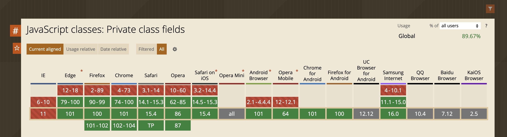
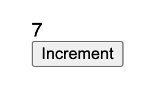

Those of us who've been web developers more than a few years have probably written code using more than one JavaScript framework. With all the choices out there — React, Svelte, Vue, Angular, Solid — it's all but inevitable. One of the more frustrating things we have to deal with when working across frameworks is re-creating all those low-level <abbr>UI</abbr> components: buttons, tabs, dropdowns, etc. What's particularly frustrating is that we'll typically have them defined in one framework, say React, but then need to rewrite them if we want to build something in Svelte. Or Vue. Or Solid. And so on.

Wouldn't it be better if we could define these low-level <abbr>UI</abbr> components once, in a framework-agnostic way, and then re-use them between frameworks? Of course it would! And we can; native web components are the way. This post will show you how.

/more

As of now, the <abbr title="server-side rendering">SSR</abbr> story for web components is a bit lacking. Declarative shadow DOM (<abbr>DSD</abbr>) is how a web component is server-side rendered, but, as of this writing, it's not integrated with your favorite applications frameworks like Next, Remix or SvelteKit. If that's a requirement for you, be sure to check the latest status of <abbr>DSD</abbr>. But otherwise, if <abbr>SSR</abbr> isn't something you're using, read on.

### First, some context

Web Components are essentially HTML elements that you define yourself, like say `<yummy-pizza>` or whatever, from the ground up. They're covered all over here at CSS-Tricks (including [an extensive series by Caleb Williams](https://css-tricks.com/an-introduction-to-web-components/) and <a href="https://css-tricks.com/web-components-are-easier-than-you-think/">one by John Rhea</a>) but we'll briefly walk through the process. Essentially, you define a JavaScript class, inherit it from `HTMLElement`, and then define whatever properties, attributes and styles the web component has and, of course, the markup it will ultimately render to your users.

Being able to define custom HTML elements that aren't bound to any particular component is exciting. But this freedom can also a limitation. Existing independently of any JavaScript framework means you can't really interact with those JavaScript frameworks. Think of a React component which fetches some data and then renders some *other* React component, passing along the data. This wouldn't really work as a web component, since a web component doesn't really know how to render a React component.

Web components particularly excel as **leaf components**. <dfn id="leaf">Leaf components<dfn> are the last thing to be rendered in a component tree. These are the components which receive some props, and render some <abbr>UI</abbr>. These are *not* the components sitting in the middle of your component tree, passing data along, setting context, etc. — just pure pieces of <abbr>UI</abbr> that will look the same, no matter which JavaScript framework is powering the rest of the app.

### The web component we're building

Rather than building something boring (and common), like a button, let's build something a little bit different. In my [last post](https://css-tricks.com/inline-image-previews-with-sharp-blurhash-and-lambda-functions/) we looked at using blurry image previews to prevent content reflow, and provide a decent <abbr>UI</abbr> for users while our images load. We looked at base64 encoding a blurry, degraded versions of our images, and showing that in our <abbr>UI</abbr> while the real image loaded. We also looked at generating incredibly compact, blurry previews using a tool called [Blurhash](https://blurha.sh/).

That post showed you how to generate those previews and use them in a React project. This post will show you how to use those previews from a native web component so they can be used by *any* JavaScript framework.

But we need to walk before we can run, so we'll walk through something trivial and silly first to see exactly how web components work.

Everything in this post will build vanilla web components without any tooling. That means the code will have a bit of boilerplate, but should be relatively easy to follow. As I mentioned above, tools like Lit and Stencil are designed for building web components and can be used to remove much of this boilerplate. I urge you to check them out! But for this post, I'll prefer a little more boilerplate in exchange for not having to introduce and teach another dependency.

### A simple counter component

Let's build the classic "Hello World" of JavaScript components: a counter. We'll render a value, and a button that increments that value. Simple and boring, but it'll let us look at the simplest possible web component.

In order to build a web component, the first step is to make a JavaScript class, which inherits from `HTMLElement`:

    class Counter extends HTMLElement {
    }

The last step is to register the web component, but only if we haven't registered it already:

    if (!customElements.get("counter-wc")) {
      customElements.define("counter-wc", Counter);
    }

And, of course, render it:

    <counter-wc></counter-wc>

And everything in between is us making the web component do whatever we want it to. One common lifecycle method is `connectedCallback`, which fires when our web component is added to the DOM. We could use that method to render whatever content we'd like. Remember, this is a JS class inheriting from `HTMLElement`, which means our `this` value is the web component element itself, with all the normal DOM manipulation methods you already know and love.

At it's most simple, we could do this:

    class Counter extends HTMLElement {
      connectedCallback() {
        this.innerHTML = "
Hey
";
      }
    }

    if (!customElements.get("counter-wc")) {
      customElements.define("counter-wc", Counter);
    }

...which will work just fine.

#### Adding real content

Let's add some useful, interactive content. We need a `` to hold the current number value and a `<button>` to increment the counter. For now, we'll create this content in our constructor and append it when the web component is actually in the DOM:

    constructor() {
      super();
      const container = document.createElement('div');

      this.valSpan = document.createElement('span');

      const increment = document.createElement('button');
      increment.innerText = 'Increment';
      increment.addEventListener('click', () => {
        this.#value = this.#currentValue + 1;
      });

      container.appendChild(this.valSpan);
      container.appendChild(document.createElement('br'));
      container.appendChild(increment);

      this.container = container;
    }

    connectedCallback() {
      this.appendChild(this.container);
      this.update();
    }

If you're really grossed out by the manual DOM creation, remember you can set `innerHTML`, create a template element once, set it as a static property of your web component class, clone it, and insert the contents for new web components instances if you prefer. There's probably some other options I'm not thinking of, or you can always use a web component framework like [Lit])(https://lit.dev) or [Stencil](https://stenciljs.com). But for this post, we'll continue to keep it simple. 

Moving on, we need a settable JavaScript class property named `value`

    #currentValue = 0;

    set #value(val) {
      this.#currentValue = val;
      this.update();
    }

It's just a standard class property with a setter, along with a second property to hold the value. One fun twist is that I'm using a private JavaScript class property syntax for these values. That means nobody outside our web component can ever touch these values. This is standard JavaScript that's supported in all modern browsers, so don't be afraid to use it. 
  

Or feel free to call it `_value` if you prefer.

And, lastly, our `update` method:

    update() {
      this.valSpan.innerText = this.#currentValue;
    }

It works!

Obviously this is not code you'd want to maintain at scale. Here's a full [working example](https://stackblitz.com/edit/vitejs-vite-7f6brw?file=counter-wc.js) if you'd like a closer look. As I've said, tools like Lit and Stencil are designed to make this simpler.

#### Adding some more functionality 

This post is not a deep dive into web components. We won't cover all the APIs and lifecycles; we won't even cover [shadow roots or slots](https://css-tricks.com/extracting-text-from-content-using-html-slot-html-template-and-shadow-dom/). There's endless content on those topics. My goal here is to provide a decent enough introduction to spark some interest, along with some useful guidance on actually *using* web components with the popular JavaScript frameworks you already know and love.

To that end, let's enhance our counter web component a bit. Let's have it accept a `color` attribute, to control the color of the value that's displayed. And let's also have it accept an `increment` property, so consumers of this web component can have it increment by 2, 3, 4 at a time. And to drive these state changes, let's use our new counter in a Svelte sandbox — we'll get to React in a bit.

We'll start with the same web component as before and add a color attribute. To configure our web component to accept and respond to an attribute, we add a static `observedAttributes` property that returns the attributes that our web component listens for.

    static observedAttributes = ["color"];

With that in place, we can add a `attributeChangedCallback` lifecycle method, which will run whenever any of the attributes listed in `observedAttributes` are set, or updated.

    attributeChangedCallback(name, oldValue, newValue) {
      if (name === "color") {
        this.update();
      }
    }

Now we update our `update` method to actually use it:

    update() {
      this.valSpan.innerText = this._currentValue;
      this.valSpan.style.color = this.getAttribute("color") || "black";
    }

Lastly, let's add our `increment` property:

    increment = 1;

Simple and humble.

### Use the counter component in Svelte

Let's use what we just made. We'll go into our Svelte app component and add something like this:

    

    

    <main>
      <select bind:value={color}>
        <option value="red">Red</option>
        <option value="green">Green</option>
        <option value="blue">Blue</option>
      </select>

      <counter-wc color={color}></counter-wc>
    </main>

And it works! Our counter renders, increments, and the dropdown updates the color. As you can see, we render the color attribute in our Svelte template and, when the value changes, Svelte handles the legwork of calling `setAttribute` on our underlying web component instance. There's nothing special here: this is the same thing it already does for the attributes of *any* HTML element. 

Things get a little bit interesting with the `incrementAmount` prop. This is *not* an attribute on our web component; it's a prop on the web component's class. That means it needs to be set on the web component's instance. Bear with me, as things will wind up much simpler in a bit.

First, we'll add some variables to our Svelte component:

    let increment = 1;
    let wcInstance;

Our powerhouse of a counter component will let you increment by 1, or by 2:

    <button on:click={() => increment = 1}>Increment 1</button>
    <button on:click={() => increment = 2}>Increment 2</button>

But, *in theory*, we need to get the actual instance of our web component. This is the same thing we always do anytime we add a `ref` with React. With Svelte, it's a simple `bind:this` directive:

    <counter-wc bind:this={wcInstance} color={color}></counter-wc>

Now, in our Svelte template, we listen for changes to our component's increment variable and set the underlying web component property.

    $: {
      if (wcInstance) {
        wcInstance.increment = increment;
      }
    }

You can test it out [over at this live demo](https://stackblitz.com/edit/vitejs-vite-smjw4o?file=src/App.svelte).

We obviously don't want to do this for every web component or prop we need to manage. Wouldn't it be nice if we could just set `increment` right on our web component, in markup, like we normally do for component props, and have it, you know, *just work*? In other words, it'd be nice if we could delete all usages of `wcInstance` and use this simpler code instead:

  <counter-wc increment={increment} color={color}></counter-wc>

Svelte handles that legwork for us. [Check it out in this demo.](https://stackblitz.com/edit/vitejs-vite-ucexzq?file=src/App.svelte) This is standard behavior for pretty much all JavaScript frameworks.

So why did I show you the manual way of setting the web component's prop? Two reasons: it's useful to understand how these things work and, a moment ago, I said this works for "pretty much" all JavaScript frameworks. But there's one framework which, maddeningly, does not support web component prop setting like we just saw.

### React is a different beast

React. The most popular JavaScript framework on the planet does not support basic interop with web components. This is a well-known problem that's unique to React. Interestingly, this is actually fixed in React's experimental branch, but for some reason wasn't merged into version 18. That said, we can still [track the progress of it](https://custom-elements-everywhere.com/). And you can try this yourself with a [live demo](https://stackblitz.com/edit/react-ydpj3u?file=src/App.js). 

The solution, of course, is to use a `ref`, grab the web component instance, and manually set `increment` when that value changes. It looks like this:

    import React, { useState, useRef, useEffect } from 'react';
    import './counter-wc';

    export default function App() {
      const [increment, setIncrement] = useState(1);
      const [color, setColor] = useState('red');
      const wcRef = useRef(null);

      useEffect(() => {
        wcRef.current.increment = increment;
      }, [increment]);

      return (
        

          

            <button onClick={() => setIncrement(1)}>Increment by 1</button>
            <button onClick={() => setIncrement(2)}>Increment by 2</button>
          

          <select value={color} onChange={(e) => setColor(e.target.value)}>
            <option value="red">Red</option>
            <option value="green">Green</option>
            <option value="blue">Blue</option>
          </select>

          <counter-wc ref={wcRef} increment={increment} color={color}></counter-wc>
        

      );
    }

/button [Live demo](https://stackblitz.com/edit/react-y43odj?file=src%2FApp.js)

As we discussed, coding this up manually for every web component property is simply not scalable. But all is not lost because we have a couple of options.

#### Option 1: Use attributes everywhere

We have attributes. If you clicked the React demo above, the `increment` prop wasn't working, but the color correctly changed. Can't we code everything with attributes? Sadly, no. Attribute values can only be strings. That's good enough here, and we'd be able to get somewhat far with this approach. Numbers like `increment` can be converted to and from strings. We could even JSON stringify/parse objects. But eventually we'll need to pass a function into a web component, and at that point we'd be out of options.

#### Option 2: Wrap it

There's an old saying that you can solve any problem in computer science by adding a level of indirection (except the problem of too many levels of indirection). The code to set these props is pretty predictable and simple. What if we hide it in a library? The smart folks behind Lit [have one solution](https://www.npmjs.com/package/@lit-labs/react). This library creates a new React component for you after you give it a web component, then lists out the properties it needs. While it is clever, I'm not a fan of this approach.

Rather than have a one-to-one mapping of web components to manually-created React components, what we want is just *one* React component that we pass our web component *tag name* to (`counter-wc` in our case) — along with all the attributes and properties — and for this component to render our web component, add the `ref`, then figure out what is a prop and what is an attribute. That's the ideal solution in my opinion. I don't know of a library that does this, but it should be straightforward to create. Let's give it a shot!

This is the *usage* we're looking for:

    <WcWrapper wcTag="counter-wc" increment={increment} color={color} />

`wcTag` is the web component tag name; the rest are the properties and attributes we want passed along.

Here's what my implementation looks like:

    import React, { createElement, useRef, useLayoutEffect, memo } from 'react';

    const _WcWrapper = (props) => {
      const { wcTag, children, ...restProps } = props;
      const wcRef = useRef(null);

      useLayoutEffect(() => {
        const wc = wcRef.current;

        for (const [key, value] of Object.entries(restProps)) {
          if (key in wc) {
            if (wc[key] !== value) {
              wc[key] = value;
            }
          } else {
            if (wc.getAttribute(key) !== value) {
              wc.setAttribute(key, value);
            }
          }
        }
      });

      return createElement(wcTag, { ref: wcRef });
    };

    export const WcWrapper = memo(_WcWrapper);

The most interesting line is at the end:

    return createElement(wcTag, { ref: wcRef });

This is how we create an element in React with a dynamic name. In fact, this is what React normally transpiles JSX into. All our divs are converted to `createElement("div")` calls. We don't normally need to call this API directly but it's there when we need it.

Beyond that, we want to run a layout effect and loop through every prop that we've passed to our component. We loop through all of them and check to see if it's a property with an `in` check that checks the web component instance object as well as its prototype chain, which will catch any getters/setters that wind up on the class prototype. If no such property exists, it's assumed to be an attribute. In either case, we only set it if the value has actually changed.

If you're wondering why we use `useLayoutEffect` instead of `useEffect`, it's because we want to immediately run these updates before our content is rendered. Also, note that we have no dependency array to our `useLayoutEffect`; this means we want to run this update on *every render*. This can be risky since React tends to re-render *a lot*. I ameliorate this by wrapping the whole thing in `React.memo`. This is essentially the modern version of `React.PureComponent`, which means the component will only re-render if any of its actual props have changed — and it checks whether that's happened via a simple equality check. The only risk here is that if you're passing an object prop that you're mutating directly without re-assigning, then you won't see the updates. But this is highly discouraged, especially in the React community, so I wouldn't worry about it.

Before moving on, I'd like to call out one last thing. You might not be happy with how the usage looks. Again, this component is used like this:

    <WcWrapper wcTag="counter-wc" increment={increment} color={color} />

Specifically, you might not like passing the web component tag name to the `<WcWrapper>` component and prefer instead the `@lit-labs/react` package above, which creates a new individual React component for each web component. That's totally fair and I'd encourage you to use whatever you're most comfortable with. But for me, one advantage with this approach is that it's easy to *delete*. If by some miracle React merges proper web component handling from their experimental branch into `main` tomorrow, you'd be able to change the above code from this:

    <WcWrapper wcTag="counter-wc" increment={increment} color={color} />

...to this:

    <counter-wc ref={wcRef} increment={increment} color={color} />

You could probably even write a single codemod to do that everywhere, and then delete `<WcWrapper>` altogether. Actually, scratch that: a global search and replace with a RegEx would probably work.

### The implementation 

I know, it seems like it took a journey to get here. If you recall, our original goal was to take the image preview code we looked at in my [last post](https://css-tricks.com/inline-image-previews-with-sharp-blurhash-and-lambda-functions/), and move it to a web component so it can be used in any JavaScript framework. React's lack of proper interop added a lot of detail to the mix. But now that we have a decent handle on how to create a web component, and use it, the implementation will almost be anti-climactic.

I'll merely drop the entire web component here and call out some of the interesting bits. If you'd like to see it in action, here's a [working demo](https://stackblitz.com/edit/vitejs-vite-tt8yns?file=src/book-cover-wc.js). It'll switch between my three favorite books on my three favorite programming languages. The URL for each book will be unique each time, so you can see the preview, though you'll likely want to throttle things in your DevTools Network tab to really see things taking place.

/details

    class BookCover extends HTMLElement {
      static observedAttributes = ['url'];

      attributeChangedCallback(name, oldValue, newValue) {
        if (name === 'url') {
          this.createMainImage(newValue);
        }
      }

      set preview(val) {
        this.previewEl = this.createPreview(val);
        this.render();
      }

      createPreview(val) {
        if (typeof val === 'string') {
          return base64Preview(val);
        } else {
          return blurHashPreview(val);
        }
      }

      createMainImage(url) {
        this.loaded = false;
        const img = document.createElement('img');
        img.alt = 'Book cover';
        img.src = url;
        img.addEventListener('load', () => {
          if (img === this.imageEl) {
            this.loaded = true;
            this.render();
          }
        });
        this.imageEl = img;
      }

      connectedCallback() {
        this.render();
      }

      render() {
        const elementMaybe = this.loaded ? this.imageEl : this.previewEl;
        syncSingleChild(this, elementMaybe);
      }
    }

First, we register the attribute we're interested in and react when it changes: 

    static observedAttributes = ['url'];

    attributeChangedCallback(name, oldValue, newValue) {
      if (name === 'url') {
        this.createMainImage(newValue);
      }
    }

This causes our image component to be created, which will show only when loaded:

    createMainImage(url) {
      this.loaded = false;
      const img = document.createElement('img');
      img.alt = 'Book cover';
      img.src = url;
      img.addEventListener('load', () => {
        if (img === this.imageEl) {
          this.loaded = true;
          this.render();
        }
      });
      this.imageEl = img;
    }

Next we have our preview property, which can either be our base64 preview string, or our `blurhash` packet:

    set preview(val) {
      this.previewEl = this.createPreview(val);
      this.render();
    }

    createPreview(val) {
      if (typeof val === 'string') {
        return base64Preview(val);
      } else {
        return blurHashPreview(val);
      }
    }

This defers to whichever helper function we need:

    function base64Preview(val) {
      const img = document.createElement('img');
      img.src = val;
      return img;
    }

    function blurHashPreview(preview) {
      const canvasEl = document.createElement('canvas');
      const { w: width, h: height } = preview;

      canvasEl.width = width;
      canvasEl.height = height;

      const pixels = decode(preview.blurhash, width, height);
      const ctx = canvasEl.getContext('2d');
      const imageData = ctx.createImageData(width, height);
      imageData.data.set(pixels);
      ctx.putImageData(imageData, 0, 0);

      return canvasEl;
    }

And, lastly, our `render` method:

    connectedCallback() {
      this.render();
    }

    render() {
      const elementMaybe = this.loaded ? this.imageEl : this.previewEl;
      syncSingleChild(this, elementMaybe);
    }

And a few helpers methods to tie everything together:

    export function syncSingleChild(container, child) {
      const currentChild = container.firstElementChild;
      if (currentChild !== child) {
        clearContainer(container);
        if (child) {
          container.appendChild(child);
        }
      }
    }

    export function clearContainer(el) {
      let child;

      while ((child = el.firstElementChild)) {
        el.removeChild(child);
      }
    }

It's a little bit more boilerplate than we'd need if we build this in a framework, but the upside is that we can re-use this in any framework we'd like — although React will need a wrapper for now, as we discussed.

#### Odds and ends

I've already mentioned Lit's React wrapper. But if you find yourself using Stencil, it actually supports a [separate output pipeline just for React](https://stenciljs.com/docs/react). And the good folks at Microsoft have also [created something similar to Lit's wrapper](https://www.npmjs.com/package/@microsoft/fast-react-wrapper), attached to the Fast web component library.

As I mentioned, all frameworks not named React will handle setting web component properties for you. Just note that some have some special flavors of syntax. For example, with Solid.js, `<your-wc value={12}>` always assumes that `value` is a property, which you can override with an `attr` prefix, like `<your-wc attr:value={12}>`.

### Wrapping up

Web components are an interesting, often underused part of the web development landscape. They can help reduce your dependence on any single JavaScript framework by managing your <abbr>UI</abbr>, or "leaf" components. While creating these as web components — as opposed to Svelte or React components — won't be as ergonomic, the upside is that they'll be widely reusable.