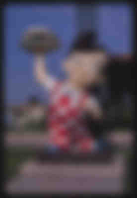

Don't you hate it when you load a website or web app, some content displays *and then* some images load — causing content to shift around? That's called [*content reflow*](https://developers.google.com/speed/docs/insights/browser-reflow) and can lead to an incredibly annoying user experience for visitors.

I've previously [written about solving this with React's Suspense](https://css-tricks.com/pre-caching-image-with-react-suspense/), which prevents the UI from loading until the images come in. This solves the content reflow problem but at the expense of performance. The user is blocked from seeing any content until the images come in.

Wouldn't it be nice if we could have the best of both worlds: prevent content reflow while also not making the user wait for the images? This post will walk through generating blurry image previews and displaying them immediately, with the real images rendering over the preview whenever they happen to come in.

## So you mean progressive JPEGs?

You might be wondering if I'm about to talk about [progressive JPEGs](https://css-tricks.com/progressive-jpgs-a-new-best-practice/), which are an alternate encoding that causes images to initially render — full size and blurry — and then gradually refine as the data come in until everything renders correctly.

This seems like a great solution until you get into some of the details. Re-encoding your images as progressive JPEGs is reasonably straightforward; there are plugins for [Sharp](https://sharp.pixelplumbing.com/) that will handle that for you. Unfortunately, you still need to wait for *some* of your images' bytes to come over the wire until even a blurry preview of your image displays, at which point your content will reflow, adjusting to the size of the image's preview.

You might look for some sort of event to indicate that an initial preview of the image has loaded, but none currently exists, and the workarounds are ... [not ideal](https://stackoverflow.com/a/48372320/352552).

Let's look at two alternatives for this.

## The libraries we'll be using

Before we start, I'd like to call out the versions of the libraries I'll be using for this post:

 - [Jimp](https://www.npmjs.com/package/jimp) version 0.16.1
 - [BlurHash](https://www.npmjs.com/package/blurhash) version 1.1.5
 - [Sharp](https://www.npmjs.com/package/sharp) version 0.30.3

## Making our own previews

Most of us are used to using `` tags by providing a `src` attribute that's a URL to some place on the internet where our image exists. But we can also provide a [Base64 encoding of an image and just set that inline](https://css-tricks.com/data-uris/). We wouldn't *usually* want to do that since those Base64 strings can get huge for images and embedding them in our JavaScript bundles can cause some serious bloat.

But what if, when we're processing our images (to resize, adjust the quality, etc.), we also make a low quality, blurry version of our image and take the Base64 encoding of *that*? The size of that Base64 image preview will be significantly smaller. We could save that preview string, put it in our JavaScript bundle, and display that inline until our real image is done loading. This will cause a blurry preview of our image to show immediately while the image loads. When the real image is done loading, we can hide the preview and show the real image.

Let's see how.

### Generating our preview

For now, let's look at [Jimp](https://www.npmjs.com/package/jimp), which has no dependencies on things like `node-gyp` and can be installed and used in a Lambda.

Here's a function (stripped of error handling and logging) that uses Jimp to process an image, resize it, and then creates a blurry preview of the image:

```js
function resizeImage(src, maxWidth, quality) {
  return new Promise<ResizeImageResult>(res => {
    Jimp.read(src, async function (err, image) {
      if (image.bitmap.width > maxWidth) {
        image.resize(maxWidth, Jimp.AUTO);
      }
      image.quality(quality);

      const previewImage = image.clone();
      previewImage.quality(25).blur(8);
      const preview = await previewImage.getBase64Async(previewImage.getMIME());

      res({ STATUS: "success", image, preview });
    });
  });
}
```

For this post, I'll be using [this image provided by Flickr Commons](https://www.flickr.com/photos/library_of_congress/37133234430/):


And here's what the preview looks like:



If you'd like to take a closer look, here's the same preview in a [CodeSandbox](https://codesandbox.io/s/base64-preview-c6nhbi?file=/index.html:158-7353).

Obviously, this preview encoding isn't small, but then again, neither is our image; smaller images will produce smaller previews. Measure and profile for your own use case to see how viable this solution is.

Now we can send that image preview down from our data layer, along with the actual image URL, and any other related data. We can immediately display the image preview, and when the actual image loads, swap it out. Here's some (simplified) React code to do that:

```js
const Landmark = ({ url, preview = "" }) => {
  const [loaded, setLoaded] = useState(false);
  const imgRef = useRef<HTMLImageElement>(null);

  useEffect(() => {
    // make sure the image src is added after the onload handler
    if (imgRef.current) {
      imgRef.current.src = url;
    }
  }, [url, imgRef, preview]);

  return (
    <>
      <Preview loaded={loaded} preview={preview} />
       setTimeout(() => setLoaded(true), 3000)}
        style={{ display: loaded ? "block" : "none" }}
      />
    </>
  );
};

const Preview: FunctionComponent<LandmarkPreviewProps> = ({ preview, loaded }) => {
  if (loaded) {
    return null;
  } else if (typeof preview === "string") {
    return ;
  } else {
    return <PreviewCanvas preview={preview} loaded={loaded} />;
  }
};
```

Don't worry about the `PreviewCanvas` component yet. And don't worry about the fact that things like a changing URL aren't accounted for.

Note that we set the image component's `src` after the `onLoad` handler to ensure it fires. We show the preview, and when the real image loads, we swap it in.

## Improving things with BlurHash

The image preview we saw before might not be small enough to send down with our JavaScript bundle. And these Base64 strings will not [gzip](https://developer.mozilla.org/en-US/docs/Web/HTTP/Headers/Content-Encoding#compressing_with_gzip) well. Depending on how many of these images you have, this may or may not be good enough. But if you'd like to compress things even smaller and you're willing to do a bit more work, there's a wonderful library called [BlurHash](https://blurha.sh/).

BlurHash generates incredibly small previews using Base83 encoding. Base83 encoding allows it to squeeze more information into fewer bytes, which is part of how it keeps the previews so small. 83 might seem like an arbitrary number, but [the README sheds some light on this](https://github.com/woltapp/blurhash#why-base-83):

> First, 83 seems to be about how many low-ASCII characters you can find that are safe for use in all of JSON, HTML and shells.

> Secondly, 83 * 83 is very close to, and a little more than, 19 * 19 * 19, making it ideal for encoding three AC components in two characters.

The README also states how [Signal and Mastodon use BlurHash](https://github.com/woltapp/blurhash#users).

Let's see it in action.

### Generating `blurhash` previews

For this, we'll need to use the [Sharp](https://www.npmjs.com/package/sharp) library.

---

**Note**

To generate your `blurhash` previews, you'll likely want to run some sort of serverless function to process your images and generate the previews. I'll be using AWS Lambda, but any alternative should work.

Just be careful about maximum size limitations. The binaries Sharp installs add about 9 MB to the serverless function's size.

To run this code in an AWS Lambda, you'll need to install the library like this:

```
install-deps": "npm i && SHARP_IGNORE_GLOBAL_LIBVIPS=1 npm i --arch=x64 --platform=linux sharp
```

And make sure you're not doing any sort of bundling to ensure all of the binaries are sent to your Lambda. This will affect the size of the Lambda deploy. Sharp alone will wind up being about 9 MB, which won't be great for cold start times. The code you'll see below is in a Lambda that just runs periodically (without any UI waiting on it), generating `blurhash` previews.

---

This code will look at the size of the image and create a `blurhash` preview:

```js
import { encode, isBlurhashValid } from "blurhash";
const sharp = require("sharp");

export async function getBlurhashPreview(src) {
  const image = sharp(src);
  const dimensions = await image.metadata();

  return new Promise(res => {
    const { width, height } = dimensions;

    image
      .raw()
      .ensureAlpha()
      .toBuffer((err, buffer) => {
        const blurhash = encode(new Uint8ClampedArray(buffer), width, height, 4, 4);
        if (isBlurhashValid(blurhash)) {
          return res({ blurhash, w: width, h: height });
        } else {
          return res(null);
        }
      });
  });
}
```

Again, I've removed all error handling and logging for clarity. Worth noting is the call to `ensureAlpha`. This ensures that each pixel has 4 bytes for RGB and Alpha.

*Jimp lacks this method, which is why we're using Sharp; if anyone knows otherwise, please drop a comment.*

Also, note that we're saving not only the preview string but also the dimensions of the image, which will make sense in a bit. 

The real work happens here:

```js
const blurhash = encode(new Uint8ClampedArray(buffer), width, height, 4, 4);
```

We're calling `blurhash`'s `encode` method, passing it our image and the image's dimensions. The last two arguments are `componentX` and `componentY`, which from my understanding of the documentation, seem to control how many passes `blurhash` does on our image, adding more and more detail. The acceptable values are 1 to 9 (inclusive). From my own testing, 4 is a sweet spot that produces the best results.

Let's see what this produces for that same image:

```json
{
  "blurhash" : "UAA]{ox^0eRiO_bJjdn~9#M_=|oLIUnzxtNG",
  "w" : 276,
  "h" : 400
}
```

That's incredibly small! The tradeoff is that *using* this preview is a bit more involved.

Basically, we need to call `blurhash`'s `decode` method and render our image preview in a `canvas` tag. This is what the `PreviewCanvas` component was doing before and why we were rendering it if the type of our preview was not a string: our `blurhash` previews use an entire object — containing not only the preview string but also the image dimensions.

Let's look at our `PreviewCanvas` component:

```js
const PreviewCanvas: FunctionComponent<CanvasPreviewProps> = ({ preview }) => {
  const canvasRef = useRef<HTMLCanvasElement>(null);

  useLayoutEffect(() => {
    const pixels = decode(preview.blurhash, preview.w, preview.h);
    const ctx = canvasRef.current.getContext("2d");
    const imageData = ctx.createImageData(preview.w, preview.h);
    imageData.data.set(pixels);
    ctx.putImageData(imageData, 0, 0);
  }, [preview]);

  return <canvas ref={canvasRef} width={preview.w} height={preview.h} />;
};
```

Not too terribly much going on here. We're decoding our preview and then calling some fairly specific Canvas APIs.

Let's see what the image previews look like:

https://codesandbox.io/s/blurhash-preview-6nh9li

In a sense, it's less detailed than our previous previews. But I've also found them to be a bit smoother and less pixelated. And they take up a tiny fraction of the size.

Test, and use what works best for you.

## Wrapping up

There are many ways to prevent content reflow as your images load on the web. One approach is to prevent your UI from rendering until the images come in. The downside is that your user winds up waiting longer for content.

A good middle-ground is to immediately show a preview of the image and swap the real thing in when it's loaded. This post walked you through two ways of accomplishing that: generating degraded, blurry versions of an image using a tool like Sharp and using BlurHash to generate an extremely small, Base83 encoded preview.

Happy coding!