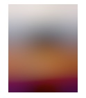
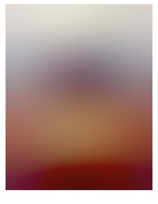

Don't you hate it when you load a website / web app, some content displays, *and then* some images load, causing content to shift around. That's called [content reflow](https://developers.google.com/speed/docs/insights/browser-reflow) and it can be incredibly annoying. I've previously [written about](https://css-tricks.com/pre-caching-image-with-react-suspense/) solving this with React's Suspense. This solution prevents the UI from loading until the images come in. 

This solves the content reflow problem, but at the expense of performance. Wouldn't is be nice if we could have the best of both worlds, prevent conent reflow, while also not making the user wait for the images come in? This post will walk through one way to do just that. We'll talk about generating blurry image previews, and displaying them immediately, with the real images rendering over the preview whenever they happen to come in.

## So you mean progressive jpeg's?

You might be wondering if I'm about to talk about progressive jpeg's. Progressive jpegs are an alternate encoding that causes the images to initially render, full size, blurry, and then gradually refine the image as the data come in, until everything renders correctly. 

This seems like a great solution until you get into some of the details. Re-encoding your images as progressive jpeg's is reasonably straightforward; there are plugins for [Sharp](https://sharp.pixelplumbing.com/) that will handle that for you. Unfortunately, you still need to wait for *some* of your images bytes to come over the wire until even a blurry preview of your image displays, at which point your content will reflow, making room for the image's preview. You might look for some sort of event to indicate that an initial preview of the image has loaded, but none exist (come on, web platform), and the workarounds are ... [not ideal](https://stackoverflow.com/a/48372320/352552).

Let's look at two alternatives for this.

## Making our own previews

Most of us are used to using `` tags by providing a `src` attribute that's a url to some places on the interenet, where our image exists. But we can also provide a Base64 encoding of an image, and just set that inline. We wouldn't *usually* want to do that, since those Base64 strings can get huge for images, and embedding them in our JS bundles can cause some serious bloat. But what if, when we're processing our images (to resize, adjust the quality, etc), we also make a low quality, blurry version of our image, and take the Base64 encoding of *that*. The size of that image (and the Base64 encoding) will be significantly smaller. We could save that preview string, put it in our JS bundle, and show that inline until our real image is done loading. 

This will cause a blurry preview of our image to show immediately, while the image loads. When the real image is done loading, we can hide the preview, and show the real image.

Let's see how.

### Generating our preview

I mentioned [Sharp](https://sharp.pixelplumbing.com/) before, which is outstanding, but it has some particular installation requirements which make it a little tricky, and non-performant to use in Lambda functions; more about that later. For now, let's look at [Jimp](https://www.npmjs.com/package/jimp), which has no dependencies on things like node-gyp, and can just be installed and used in a Lambda function.

Here's a function (stripped of error handling and logging) that uses jimp to process an image, resize it, and then creates a blurry preview of the image.

```js
function resizeImage(src, maxWidth, quality) {
  return new Promise<ResizeImageResult>(res => {
    Jimp.read(src, async function (err, image) {
      if (image.bitmap.width > maxWidth) {
        image.resize(maxWidth, Jimp.AUTO);
      }
      image.quality(quality);

      const previewImage = image.clone();
      previewImage.quality(25).blur(8);
      const preview = await previewImage.getBase64Async(previewImage.getMIME());

      res({ STATUS: "success", image, preview });
    });
  });
}
```

Let's see what this produces for the cover image for one of my favorite JavaScript books, [JavaScript, The New Toys](https://www.amazon.com/JavaScript-Toys-T-J-Crowder/dp/1119367956/ref=sr_1_3?crid=2XYI3M78ZKKLM&keywords=javascript+new+toys&qid=1650241987&sprefix=javascript+new+toys%2Caps%2C103&sr=8-3).


![Image preview](data:image/jpeg;base64,/9j/4AAQSkZJRgABAQAAAQABAAD/2wCEACAWGBwYFCAcGhwkIiAmMFA0MCwsMGJGSjpQdGZ6eHJmcG6AkLicgIiuim5woNqirr7EztDOfJri8uDI8LjKzsYBIiQkMCowXjQ0XsaEcITGxsbGxsbGxsbGxsbGxsbGxsbGxsbGxsbGxsbGxsbGxsbGxsbGxsbGxsbGxsbGxsbGxv/AABEIAD8AMgMBEQACEQEDEQH/xAGiAAABBQEBAQEBAQAAAAAAAAAAAQIDBAUGBwgJCgsQAAIBAwMCBAMFBQQEAAABfQECAwAEEQUSITFBBhNRYQcicRQygZGhCCNCscEVUtHwJDNicoIJChYXGBkaJSYnKCkqNDU2Nzg5OkNERUZHSElKU1RVVldYWVpjZGVmZ2hpanN0dXZ3eHl6g4SFhoeIiYqSk5SVlpeYmZqio6Slpqeoqaqys7S1tre4ubrCw8TFxsfIycrS09TV1tfY2drh4uPk5ebn6Onq8fLz9PX29/j5+gEAAwEBAQEBAQEBAQAAAAAAAAECAwQFBgcICQoLEQACAQIEBAMEBwUEBAABAncAAQIDEQQFITEGEkFRB2FxEyIygQgUQpGhscEJIzNS8BVictEKFiQ04SXxFxgZGiYnKCkqNTY3ODk6Q0RFRkdISUpTVFVWV1hZWmNkZWZnaGlqc3R1dnd4eXqCg4SFhoeIiYqSk5SVlpeYmZqio6Slpqeoqaqys7S1tre4ubrCw8TFxsfIycrS09TV1tfY2dri4+Tl5ufo6ery8/T19vf4+fr/2gAMAwEAAhEDEQA/AJoxigZYU0BYcTQFhu6gBGNAWIJOaAIdtAFgcUDHB6B2EL0AIXoATfQFhpOaAExQIQvQCEL0ihpegBC9MBN9IBwemIdvoEQ76RVg3UDsJmgQhNADSaBhvxQFhfMoFYYDSNLDwaVwsLmi4WENFwsNNFwsMJp3Cw3NAWHA1JY8GkAuaAEzQAhNADDTAbQABqCbi7qLBcN1KwXDdRYLibqLBcQtTC4maYXGbqZncN1FguG6iwXDdRYLhuosFxM0BcM0Bc//2Q==)


![Image preview](data:image/jpeg;base64,/9j/4AAQSkZJRgABAQAAAQABAAD/2wCEACAWGBwYFCAcGhwkIiAmMFA0MCwsMGJGSjpQdGZ6eHJmcG6AkLicgIiuim5woNqirr7EztDOfJri8uDI8LjKzsYBIiQkMCowXjQ0XsaEcITGxsbGxsbGxsbGxsbGxsbGxsbGxsbGxsbGxsbGxsbGxsbGxsbGxsbGxsbGxsbGxsbGxv/AABEIAIYAagMBEQACEQEDEQH/xAGiAAABBQEBAQEBAQAAAAAAAAAAAQIDBAUGBwgJCgsQAAIBAwMCBAMFBQQEAAABfQECAwAEEQUSITFBBhNRYQcicRQygZGhCCNCscEVUtHwJDNicoIJChYXGBkaJSYnKCkqNDU2Nzg5OkNERUZHSElKU1RVVldYWVpjZGVmZ2hpanN0dXZ3eHl6g4SFhoeIiYqSk5SVlpeYmZqio6Slpqeoqaqys7S1tre4ubrCw8TFxsfIycrS09TV1tfY2drh4uPk5ebn6Onq8fLz9PX29/j5+gEAAwEBAQEBAQEBAQAAAAAAAAECAwQFBgcICQoLEQACAQIEBAMEBwUEBAABAncAAQIDEQQFITEGEkFRB2FxEyIygQgUQpGhscEJIzNS8BVictEKFiQ04SXxFxgZGiYnKCkqNTY3ODk6Q0RFRkdISUpTVFVWV1hZWmNkZWZnaGlqc3R1dnd4eXqCg4SFhoeIiYqSk5SVlpeYmZqio6Slpqeoqaqys7S1tre4ubrCw8TFxsfIycrS09TV1tfY2dri4+Tl5ufo6ery8/T19vf4+fr/2gAMAwEAAhEDEQA/AI4loAuRrQBOFoAXbQAFaAGMtAxhFACgUAOAoELigA20ARyLxQBSmWgCttoAvQpQBdjXigCbbQAYoACKAI2FAEZFAwoEGaAHA0APAoAR14oApTJQBV2UAXoloAtJwKBj91A7DS9IdhC9ArDd1MLCUCGtQBGWoHYVXoCxMj0BYcTkUCsVpRmgRX2UAWl4oAk34FBSQxpaRokMMtBXKJ5lAOI5XzQQ0SA0yBjGgEQM1ItIbvxQXykiS0CcSYSZoIaEbmmQyPbQIfmgZG70FogeSkaoZvpFjg9MTJFegyZKJKZmxrPQNEDvSNURl6RoKslMTJ43oM2Tqc0zJi4oERk0ARvQUiB6RomMoK5hQaBNjw1MzbF30ECF6BoiZqRomMJoL5hVPNANlmI0GbZZU0yGPzQIrhs0CFPNAyN1oHciIoHcSgLhQTcKBCGgYxqB3GGgdxy0BcsIcUCuTCTFAg82gRAj0ATBs0ADUDIyKBDcUAKBQAu2gBCtADGWgCMigYDigBwbFACGSgBvm0AIj0i7E6PQFiTdQKwhNAWEphYUUCsLmgLATQFhjUh2I2oCww0BYaTQOxGxoCw3NAWJFpG3KSqaA5R4agOUXdQLlDdTDlDdSuLlF3UXDlE3UByiFqB8o0mgOUaaB8ow0ByjCKA5RuKBWJQKRqPApXAdRcBaLgFFxWCi4WFouFhKLhYSi4WDFFwExRcYhFFwGEUxDcUwHrUjJVFSwuPxSuK4baLhcTFFwuLilcAxRcBMU7gGKLhcMUrhcNtFwuNIpphcjarQDKYDlpASqaliJAakQZoATNABmgBM0DDNABmgABoAUmkIYxqkMiY1SAZVAOBpCHhqQDt1KwBuosAbqLAJuosAm6iwxN1FgDdRYBd9FgDfRYQhaiwxhNUIbmmIAaBXF3UBcXdRYLhuoC4m6kFw3UBcM0DuGaAuJuoC4bqLBcN1FhXDdQFxM0wuJmgVxuaZFxc0BcN1AXDdQFwzQFwzQFxc0BcM0BcTNAXDNAXEzQFwzQFwzQFwzQK42qICgdwoAKQXFoC4UALQFwoC4lAXEoFcKYXCgLhQAUAf/9k=)

Here's what the image preview looks like for the smaller version of that image 

> data:image/jpeg;base64,/9j/4AAQSkZJRgABAQAAAQABAAD/2wCEACAWGBwYFCAcGhwkIiAmMFA0MCwsMGJGSjpQdGZ6eHJmcG6AkLicgIiuim5woNqirr7EztDOfJri8uDI8LjKzsYBIiQkMCowXjQ0XsaEcITGxsbGxsbGxsbGxsbGxsbGxsbGxsbGxsbGxsbGxsbGxsbGxsbGxsbGxsbGxsbGxsbGxv/AABEIAD8AMgMBEQACEQEDEQH/xAGiAAABBQEBAQEBAQAAAAAAAAAAAQIDBAUGBwgJCgsQAAIBAwMCBAMFBQQEAAABfQECAwAEEQUSITFBBhNRYQcicRQygZGhCCNCscEVUtHwJDNicoIJChYXGBkaJSYnKCkqNDU2Nzg5OkNERUZHSElKU1RVVldYWVpjZGVmZ2hpanN0dXZ3eHl6g4SFhoeIiYqSk5SVlpeYmZqio6Slpqeoqaqys7S1tre4ubrCw8TFxsfIycrS09TV1tfY2drh4uPk5ebn6Onq8fLz9PX29/j5+gEAAwEBAQEBAQEBAQAAAAAAAAECAwQFBgcICQoLEQACAQIEBAMEBwUEBAABAncAAQIDEQQFITEGEkFRB2FxEyIygQgUQpGhscEJIzNS8BVictEKFiQ04SXxFxgZGiYnKCkqNTY3ODk6Q0RFRkdISUpTVFVWV1hZWmNkZWZnaGlqc3R1dnd4eXqCg4SFhoeIiYqSk5SVlpeYmZqio6Slpqeoqaqys7S1tre4ubrCw8TFxsfIycrS09TV1tfY2dri4+Tl5ufo6ery8/T19vf4+fr/2gAMAwEAAhEDEQA/AJoxigZYU0BYcTQFhu6gBGNAWIJOaAIdtAFgcUDHB6B2EL0AIXoATfQFhpOaAExQIQvQCEL0ihpegBC9MBN9IBwemIdvoEQ76RVg3UDsJmgQhNADSaBhvxQFhfMoFYYDSNLDwaVwsLmi4WENFwsNNFwsMJp3Cw3NAWHA1JY8GkAuaAEzQAhNADDTAbQABqCbi7qLBcN1KwXDdRYLibqLBcQtTC4maYXGbqZncN1FguG6iwXDdRYLhuosFxM0BcM0Bc//2Q==

Now we can send that image preview down from our data layer, along with the actual image url, and of course any other related data. We can immediately display the image preview, and when the actual image loads, swap it out. Here's what some (simplified) React code might look like.

```js
const Cover = ({ url, preview = "" }) => {
  const [loaded, setLoaded] = useState(false);
  const imgRef = useRef<HTMLImageElement>(null);

  useEffect(() => {
    // make sure the image src is added after the onload handler
    if (imgRef.current) {
      imgRef.current.src = url;
    }
  }, [url, imgRef, preview]);

  return (
    <>
      <Preview loaded={loaded} preview={preview} />
       setTimeout(() => setLoaded(true), 3000)}
        style={{ display: loaded ? "block" : "none" }}
      />
    </>
  );
};

const Preview: FunctionComponent<CoverPreviewProps> = ({ preview, loaded }) => {
  if (loaded) {
    return null;
  } else if (typeof preview === "string") {
    return ;
  } else {
    return <PreviewCanvas preview={preview} loaded={loaded} />;
  }
};
```

Don't worry about the `PreviewCanvas` component, yet, and don't worry about the fact that things like a changing url aren't accounted for. 

We take care to set the image component's src after the onLoad handler, to ensure it fires. We show the preview, and then the real image loads, we swap it in.

## Improving tings with Blurhash

The image preview we saw before was small, but not *that* small. The the preview for the larger image was, unsurprisingly, about twice as big. And these strings will not gzip all that well. Depending on how many of these images you have, this may or may not be good enough. But if you'd like to compress things even smaller, and you're willing to do a bit more work, there's a wonderful tool called [Blurhash](https://blurha.sh/) that will help us out. Let's see how.

### Generating Blurhash previews

For this, we'll need to use the [Sharp](https://www.npmjs.com/package/sharp) library.

---

**Note**

To run this code in an AWS Lambda, you'll need to inatell the library like this 

> install-deps": "npm i && SHARP_IGNORE_GLOBAL_LIBVIPS=1 npm i --arch=x64 --platform=linux sharp

And of course make sure you're not doing any sort of bundling, to ensure all of the binaries are sent to your Lambda. This will affect the size of the Lambda deploy. Sharp alone will wind up being about 9MB, which won't be great for cold start times. For me, the code you'll see below is in a Lambda that just runs periodically, (without any UI waiting on it) generating smaller Blurhash previews.

---

The docs for Blurhash are extremely lacking, but this code will look at the size of the image, and create a blurhash preview (again I've removed all error handling and logging, for clarity)

```js
import { encode, isBlurhashValid } from "blurhash";
const sharp = require("sharp");

export async function getBlurhashPreview(src) {
  const image = sharp(src);
  const dimensions = await image.metadata();

  return new Promise(res => {
    const { width, height } = dimensions;

    image
      .raw()
      .ensureAlpha()
      .toBuffer((err, buffer) => {
        const blurhash = encode(new Uint8ClampedArray(buffer), width, height, 4, 4);
        if (isBlurhashValid(blurhash)) {
          return res({ blurhash, w: width, h: height });
        } else {
          return res(null);
        }
      });
  });
}
```

Worth noting is the call to `ensureAlpha`. This ensures that each pixel has 4 bytes, for RGB, and Alpha. Jimp lacks this method, which is why we're using Sharp, here; if anyone knows otherwise, please drop a comment. Also note that we're saving not only the preview string, but also the dimensions of the image, which will make sense in a bit. 

The real work happens here

```js
const blurhash = encode(new Uint8ClampedArray(buffer), width, height, 4, 4);
```

We're caling blurhash's `encode` method, passing it our image, as well as the image's dimensions. The last two arguments are `componentX` and `componentY` which seem to (again the docs are extremely lacking, this is what I can tell from the code) control how many passes blurhash does on our image, adding more and more detail. The acceptable values are 1 to 9, inclusive, and from my own testing 4 is a sweet spot, that produces the best results.

Let's see what this code produces for the small version of the same image from before

```json
{
  "blurhash" : "UlI;6gt7ogjZ?^ofofWVx^ayWBay=_j[Rjjs",
  "w" : 50,
  "h" : 63
}
```

That's incredibly small, and the larger image isn't much bigger—it's actually not any bigger!

```json
{
  "blurhash" : "UlJ7H{t7ogay?^ofofWVx]ayWBay-nj[RQjZ",
  "w" : 106,
  "h" : 134
}
```

This is a base 83 encoding of the image, which is why it's so small. The tradeoff is that *using* this preview is a tiny bit more involved. Basically, we need to call blurhash's `decode` method, and render our image preview in a canvas tag. This is what the `PreviewCanvas` component was doing before, and why we were rendering it if the typeof our preview was not string, since for our blurhash previews we're using an entire object, containing not only the preview string, but the image dimensions.

Ok, let's look at our `PreviewCanvas` component.

```js
const PreviewCanvas: FunctionComponent<CanvasPreviewProps> = ({ preview }) => {
  const canvasRef = useRef<HTMLCanvasElement>(null);

  useLayoutEffect(() => {
    const pixels = decode(preview.blurhash, preview.w, preview.h);
    const ctx = canvasRef.current.getContext("2d");
    const imageData = ctx.createImageData(preview.w, preview.h);
    imageData.data.set(pixels);
    ctx.putImageData(imageData, 0, 0);
  }, [preview]);

  return <canvas ref={canvasRef} width={preview.w} height={preview.h} />;
};
```

Not too terribly much going on here. We're decoding our preview, and then calling some fairly specific Canvas api's.

Let's see what the image previews look like





In a sense, it's less detailed than our previous previews. But I've also found them to be a bit smoother, and less pixelated; and of course they take up a tiny fraction of the size.

Test, and use what works best for you.

## Wrapping up

There are many ways to prevent content re-flow as your images load on the web. Preventing your UI from rendering at all until the images come in is one way. The downside is that your user winds up waiting longer for content. A good middleground is to immediately show a preview of the image, and just swap the real thing in when it's loaded. This post walked you through two ways of doing that: generating degraded, blurry versions of an image using a tool like Sharp, and using Blurhash to generate an extremely small, Base83 encoded preview.

Happy coding!