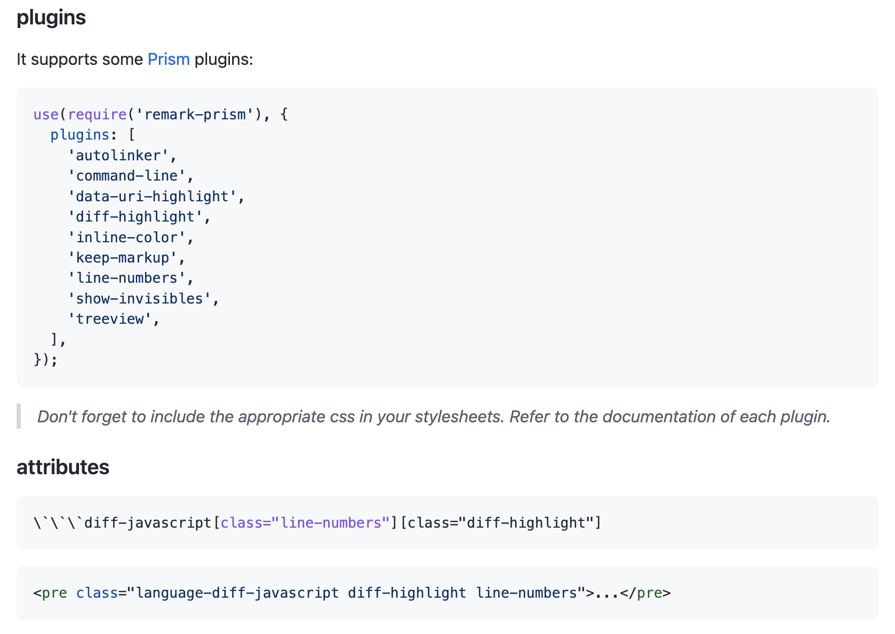

So you've decided to build a blog with Next. You're writing your first post, and you'd like the have the code snippets formatted nicely, with line numbers, and maybe even line highlighting, so you can call attention to certain lines. For this post, we'll be using Prism for our code formatting, which is a superb utility.

Unfortunately, the details for how to get everything integrated can be hidden in plain sight, and for line highlighting in particular, not _directly_ supported, requiring some creativity on our part. This post will walk you through all of this.

This post will assume you're using the Next blog starter, which is located [here](https://github.com/vercel/next.js/tree/canary/examples/blog-starter). That repo has clear (and simple) getting started instructions. Scaffold the blog, and we'll get started.

## Basic Prism integration

The Next blog package uses Remark to turn Markdown into blog posts, and so we'll use remark-prism to get code formatting working. Install it with your favorite package manager:

```bash
npm i remark-prism
```

Now go into the markdownToHtml file, in the `lib` folder, and switch on remark-prism

```js
  import remarkPrism from "remark-prism";

  // later ...

  .use(remarkPrism, { plugins: ["line-numbers"] })
```

Depending on the version of `remark-html` you're using, you might also need to change its usage to `.use(html, { sanitize: false })`

the whole module should now look like this

```js
import { remark } from "remark";
import html from "remark-html";
import remarkPrism from "remark-prism";

export default async function markdownToHtml(markdown) {
  const result = await remark()
    .use(html, { sanitize: false })
    .use(remarkPrism, { plugins: ["line-numbers"] })
    .process(markdown);

  return result.toString();
}
```

### Adding our styles and theme

Now let's import some css that Prism needs. In the pages/\_app.js file, let's import the main Prism stylesheet, and the one for whichever theme you'd like to use. I'm using the tomorrow theme, so mine looks like this

```js
import "prismjs/themes/prism-tomorrow.css";
import "prismjs/plugins/line-numbers/prism-line-numbers.css";
import "../styles/prism-overrides.css";
```

Notice that I've also started a prism-overrides stylesheet, so we can tweak some defaults. This will become useful later. For now, just leave it empty.

And with that, we now have some basic styles

<pre>
```js
class Shape {
  draw() {
    console.log("Uhhh maybe override me");
  }
}

class Circle {
  draw() {
    console.log("I'm a circle! :D");
  }
}
```
</pre>

And now we should have some nicely formatted code


## Adding line numbers

You might have noticed that the previous code did not display line-numbers, even though we enabled that plugin when we first setup remark-prism. The solution is hidden in plain sight in the remark-prism docs.



For the line-numbers plugin, we need to force a line-numbers css class onto the generated `pre` tag, which we can do like this

<pre>
```js[class="line-numbers"]
</pre>


Note that, based on the version of Prism I have, and the theme I chose, I needed to add this

```css
.line-numbers span.line-numbers-rows {
  margin-top: -1px;
}
```

to the prism-overrides css file we started above.

Overall, that was easy. Our next, and last feature will be a bit more work.

## Highlighting lines

There's a [line highlight Prism plugin](https://prismjs.com/plugins/line-highlight/); unfortunately, it is not integrated with remark-prism. Any attempts to integrate it will fail. The reason for this is because it works by analyzing the formatted code's position in the dom, and manually highlights your lines based on that information. Unfortunately, this is not possible with the remark-prism plugin, since there is no dom at the time the plugin runs. This is, after all, static site generation, or ssg. Next is running our markdown through a build step, and generating html to render as our blog. All of this Prism code runs during this static site generation, when there is no dom.

But fear not, there's a fun workaround: we can highlight lines with plain css (and some JavaScript).

### Our Base CSS

Let's start by adding the following css to our prism-overrides stylesheet

```css
:root {
  --highlight-background: rgba(0, 0, 0, 0);
  --highlight-width: 0;
}

.line-numbers span.line-numbers-rows > span {
  position: relative;
}

.line-numbers span.line-numbers-rows > span::after {
  content: " ";
  background: var(--highlight-background);
  width: var(--highlight-width);
  position: absolute;
  top: 0;
}
```

We're defining some css vars: a background color, and a highlight width. We'll set them to empty values here; later, we'll selectively set meaningful values in JavaScript, for the lines we want highlighted.

We're then setting the line number span to position relative, so that we can add a `::after` pseudo element with absolute positioning. It's this pseudoelement that we'll use to highlihgt out lines.

### Declaring the highlighted lines

We'll manually add a data-\* attribute to the pre tag that's generated, and then read that in code, and use JavaScript to tweak the styles above, to highlight the desired code. We can do this in the same way that we added line numbers before

<pre>
```js[class="line-numbers"][data-line="3,8-10"]
class Shape {
  draw() {
    console.log("Uhhh maybe override me");
  }
}

class Circle {
  draw() {
    console.log("I'm a circle! :D");
  }
}
```
</pre>

This will cause our `pre` element to be rendered with a `data-line="3,8-10"` attribute.

Let's look at how we can parse that in JavaScript, and get some highlighting working.

### Reading the highlighted lines

Let's head over to components/post-body.tsx. If this file is JavaScript for you, feel free to either convert it to tsx, or just ignore all my typings.

First, we'll need some imports

```js
import { useEffect, useRef } from "react";
```

let's add a ref to this component

```js
const rootRef = useRef < HTMLDivElement > null;
```

and then apply it to the root element

```js
<div ref={rootRef} className="max-w-2xl mx-auto">
```

The next piece of code is a little long, but it's not doing anything crazy. I'll show it, then walk through it.

```js
useEffect(() => {
  const allPres = rootRef.current.querySelectorAll("pre");
  const cleanup: (() => void)[] = [];

  for (const pre of allPres) {
    const code = pre.firstElementChild;
    if (!code || !/code/i.test(code.tagName)) {
      continue;
    }

    const highlightRanges = pre.dataset.line;
    const lineNumbersContainer = pre.querySelector(".line-numbers-rows");

    if (!highlightRanges || !lineNumbersContainer) {
      continue;
    }

    const runHighlight = () =>
      highlightCode(pre, highlightRanges, lineNumbersContainer);
    runHighlight();

    const ro = new ResizeObserver(runHighlight);
    ro.observe(pre);

    cleanup.push(() => ro.disconnect());
  }

  return () => cleanup.forEach(f => f());
}, []);
```

We're running an effect once, when the content has all been rendered to the screen. We're using querySelectorAll to grab all the `pre` elements under this root element, in other words, in whatever blog post the user is viewing.

For each one, we make sure there's a `code` element under it, and we check for the line-numbers-rows css class, and the `data-line` attribute—that's what dataset.line checks, check [the docs](https://developer.mozilla.org/en-US/docs/Web/API/HTMLElement/dataset) for more info.

If we make it past the second `continue`, then `highlightRanges` is the set of highlights we declared earlier, in our case `"3,8-10"`, and lineNumbersContainer is the container with the `line-numbers-rows` css class.

We declare a `runHighlight` function, which calls a `highlightCode` function I'm about to show you. And we then set up a ResizeObserver to run that same function anytime our blog post changes size, ie, if the user resizes their browser.

### The highlightCode function

Finally, let's see the highlightCode function

```js
function highlightCode(pre, highlightRanges, lineNumberRowsContainer) {
  const ranges = highlightRanges.split(",").filter(val => val);
  const preWidth = pre.scrollWidth;

  for (const range of ranges) {
    let [start, end] = range.split("-");
    if (!start || !end) {
      start = range;
      end = range;
    }

    for (let i = +start; i <= +end; i++) {
      const lineNumberSpan: HTMLSpanElement = lineNumberRowsContainer.querySelector(
        `span:nth-child(${i})`
      );
      lineNumberSpan.style.setProperty(
        "--highlight-background",
        "rgba(100, 100, 100, 0.5)"
      );
      lineNumberSpan.style.setProperty("--highlight-width", `${preWidth}px`);
    }
  }
}
```

We get each range. We read the width of the `pre` element.

Then we loop through each range, find the relevant line number span, and we set the css vars from before for them. We set whatever highlight color we want, and we set the width to the total scrollWidth of the `pre`. I kept it simple and used `"rgba(100, 100, 100, 0.5)"` but feel free to use whatever you think looks best for your blog.

Here's what it looks like


### Line highlighting without line numbers?

You may have noticed that this depends on the line numbers being present. What if we want to highlight lines, but not have those line numbers?

One way to implement this would be to keep everything the same, and then add a new option to just hide those line numbers—as an added bonus, we can do this with just vanilla css. Let's take a look.

First, we'll add a new css class, `hide-numbers`.

<pre>
```js[class="line-numbers"][class="hide-numbers"][data-line="3,8-10"]
class Shape {
  draw() {
    console.log("Uhhh maybe override me");
  }
}

class Circle {
  draw() {
    console.log("I'm a circle! :D");
  }
}
```
</pre>

Now let's add some css rules to hide the line numbers when this class is present.

```css
.line-numbers.hide-numbers {
  padding: 1em !important;
}
.hide-numbers .line-numbers-rows {
  width: 0;
}
.hide-numbers .line-numbers-rows > span::before {
  content: " ";
}
.hide-numbers .line-numbers-rows > span {
  padding-left: 2.8em;
}
```

The first rule undoes the shift to the right of the code, in order to make room for the line numbers. By default, with the theme I chose, the padding is 1em. This rule reverts back to that.

The second rule takes the container of line numbers, and squishes it to have no width.

The third rule erases all of the line numbers themselves (they're generated with ::before pseudoelements).

The last rule just shifts the now-empty line number spans back to where they would have been, so the highlighting can be positioned how it should be. For my theme, the line numbers normally adds a 3.8em left padding. This adds the other 2.8, after the 1em padding we added in the first rule.

If you're using different plugins, you might need slightly different values.

Here's what the result looks like


