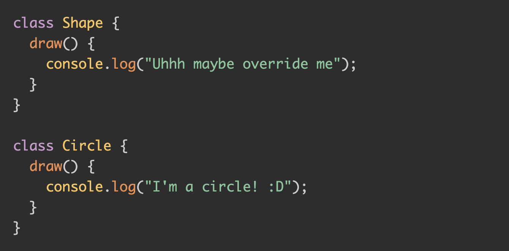
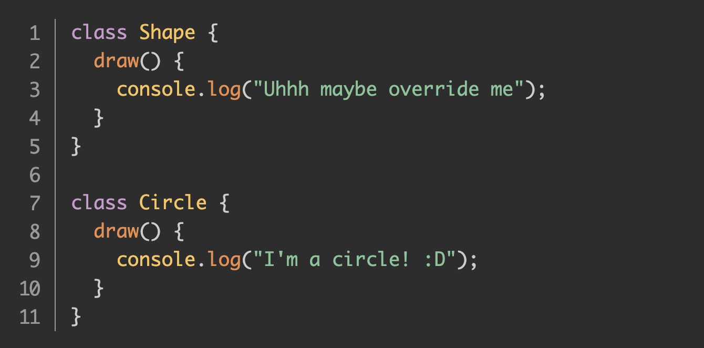
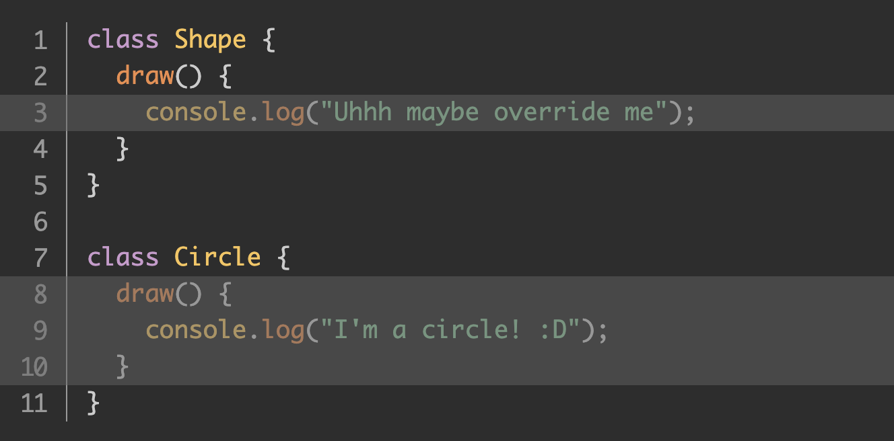
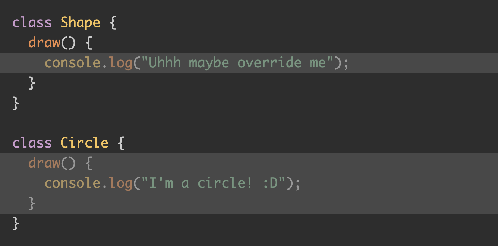
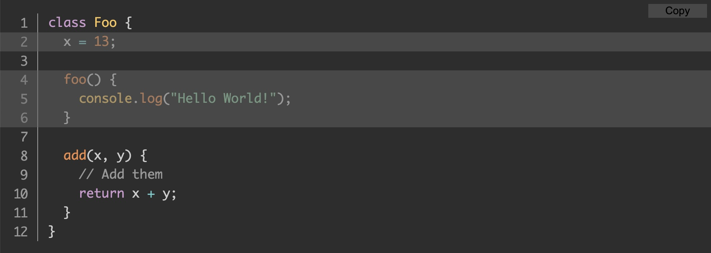

So, you've decided to build a blog with [Next.js](https://nextjs.org). And like any dev blogger, you'd like to have code snippets in your posts that are formatted nicely with syntax highlighting. Perhaps you want to display line numbers in the snippets, too, and maybe even have the ability to call out certain lines of code.

This post will show you how to get that set up, as well as some tips and tricks for getting these other features working. Some of it is tricker than you might expect.

### Prerequisites

We're using the [Next.js blog starter](https://github.com/vercel/next.js/tree/canary/examples/blog-starter) as the base for our project, but the same principles should apply to other frameworks. That repo has clear (and simple) getting started instructions. Scaffold the blog, and let's get started!

Another thing we're using here is [Prism.js](https://prismjs.com), a popular syntax highlighting library that's even used right here on CSS-Tricks. The Next.js blog starter uses [Remark](https://remark.js.org) to convert Markdown into markup, so we can actually use the [remark-Prism.js plugin](https://github.com/sergioramos/remark-prism) for formatting our code snippets.

### Basic Prism.js integration
Let's start by integrating Prism.js into our Next.js starter. Since we already know we're using the remark-prism plugin, the first thing to do is install it with your favorite package manager:

```bash
npm i remark-prism
```

Now go into the `markdownToHtml` file, in the `/lib` folder, and switch on remark-prism:

```js
import remarkPrism.js from "remark-prism";

// later ...

.use(remarkPrism, { plugins: ["line-numbers"] })
```

Depending on which version of the [remark-html](https://github.com/remarkjs/remark-html) you're using, you might also need to change its usage to `.use(html, { sanitize: false })`.

The whole module should now look like this:

```js
import { remark } from "remark";
import html from "remark-html";
import remarkPrism.js from "remark-prism";

export default async function markdownToHtml(markdown) {
  const result = await remark()
    .use(html, { sanitize: false })
    .use(remarkPrism, { plugins: ["line-numbers"] })
    .process(markdown);

  return result.toString();
}
```

#### Adding Prism.js styles and theme

Now let's import the CSS that Prism.js needs to style the code snippets. In the `pages/\_app.js` file, import the main Prism.js stylesheet, and the stylesheet for whichever theme you'd like to use. I'm using Prism.js's "Tomorrow Night" theme, so my imports looks like this:

```js
import "prismjs/themes/prism-tomorrow.css";
import "prismjs/plugins/line-numbers/prism-line-numbers.css";
import "../styles/prism-overrides.css";
```

Notice I've also started a `prism-overrides.css` stylesheet where we can tweak some defaults. This will become useful later. For now, it can remain empty.

And with that, we now have some basic styles. The following code in Markdown:

<pre>
```js
class Shape {
  draw() {
    console.log("Uhhh maybe override me");
  }
}

class Circle {
  draw() {
    console.log("I'm a circle! :D");
  }
}
```
</pre>

...should format nicely



### Adding line numbers

You might have noticed that the code snippet we generated does not display line numbers even though we imported the plugin that supports it at the same time we imported remark-prism. The solution is hidden in plain sight in the remark-prism README:

> Don't forget to include the appropriate css in your stylesheets.

In other words, we need to force a `.line-numbers` CSS class onto the generated `<pre>` tag, which we can do like this:

<pre>
```js[class="line-numbers"]
</pre>

And with that, we now have line numbers!



Note that, based on the version of Prism.js I have and the "Tomorrow Night" theme I chose, I needed to add this to the `prism-overrides.css` file we started above:

```css
.line-numbers span.line-numbers-rows {
  margin-top: -1px;
}
```
You may not need that, but there you have it. We have line numbers!

### Highlighting lines

Our next feature will be a bit more work. This is where we want the ability to highlight or call out certain lines of code in the snippet.

There's a [Prism.js line-highlight plugin](https://prismjs.com/plugins/line-highlight/); unfortunately, it is not integrated with remark-prism. The plugin works by analyzing the formatted code's position in the DOM, and manually highlights lines based on that information. That's impossible with the remark-prism plugin since there is no DOM at the time the plugin runs. This is, after all, static site generation. Next.js is running our Markdown through a build step and generating HTML to render the blog. All of this Prism.js code runs during this static site generation, when there is no DOM.

But fear not! There's a fun workaround that fits right in with CSS-Tricks: we can use plain CSS (and a dash of JavaScript) to highlight lines of code.

Let me be clear that this is a non-trivial amount of work. If you don't need line highlighting, then feel free to skip to the next section. But if nothing else, it can be a fun demonstration of what's possible.

#### Our base CSS

Let's start by adding the following CSS to our `prism-overrides.css` stylesheet:

```css
:root {
  --highlight-background: rgb(0 0 0 / 0);
  --highlight-width: 0;
}

.line-numbers span.line-numbers-rows > span {
  position: relative;
}

.line-numbers span.line-numbers-rows > span::after {
  content: " ";
  background: var(--highlight-background);
  width: var(--highlight-width);
  position: absolute;
  top: 0;
}
```

We're defining some CSS custom properties up front: a background color and a highlight width. We're setting them to empty values for now. Later, though, we'll set meaningful values in JavaScript for the lines we want highlighted.

We're then setting the line number `<span>` to `position: relative`, so that we can add a `::after` pseudo element with absolute positioning. It's this pseudo element that we'll use to highlight our lines.

#### Declaring the highlighted lines

Now, let's manually add a [data attribute](https://css-tricks.com/a-complete-guide-to-data-attributes/) to the `<pre>` tag that's generated, then read that in code, and use JavaScript to tweak the styles above to highlight specific lines of code. We can do this the same way that we added line numbers before:

<pre>
```js[class="line-numbers"][data-line="3,8-10"]
class Shape {
  draw() {
    console.log("Uhhh maybe override me");
  }
}

class Circle {
  draw() {
    console.log("I'm a circle! :D");
  }
}
```
</pre>

This will cause our `<pre>` element to be rendered with a `data-line="3,8-10"` attribute, where line 3 and lines 8-10 are highlighted in the code snippet. We can comma-separate line numbers, or provide ranges.

Let's look at how we can parse that in JavaScript, and get highlighting working.

#### Reading the highlighted lines

Head over to `components/post-body.tsx`. If this file is JavaScript for you, feel free to either convert it to TypeScript (`.tsx`), or just ignore all my typings.

First, we'll need some imports:

```js
import { useEffect, useRef } from "react";
```

And we need to add a `ref` to this component:

```ts
const rootRef = useRef<HTMLDivElement>(null);
```

Then, we apply it to the `root` element:

```js
<div ref={rootRef} className="max-w-2xl mx-auto">
```

The next piece of code is a little long, but it's not doing anything crazy. I'll show it, then walk through it.

```ts
useEffect(() => {
  const allPres = rootRef.current.querySelectorAll("pre");
  const cleanup: (() => void)[] = [];

  for (const pre of allPres) {
    const code = pre.firstElementChild;
    if (!code || !/code/i.test(code.tagName)) {
      continue;
    }

    const highlightRanges = pre.dataset.line;
    const lineNumbersContainer = pre.querySelector(".line-numbers-rows");

    if (!highlightRanges || !lineNumbersContainer) {
      continue;
    }

    const runHighlight = () =>
      highlightCode(pre, highlightRanges, lineNumbersContainer);
    runHighlight();

    const ro = new ResizeObserver(runHighlight);
    ro.observe(pre);

    cleanup.push(() => ro.disconnect());
  }

  return () => cleanup.forEach(f => f());
}, []);
```

We're running an effect once, when the content has all been rendered to the screen. We're using `querySelectorAll` to grab all the `<pre>` elements under this `root` element; in other words, whatever blog post the user is viewing.

For each one, we make sure there's a `<code>` element under it, and we check for both the line numbers container and the `data-line` attribute. That's what `dataset.line` checks. See [the docs](https://developer.mozilla.org/en-US/docs/Web/API/HTMLElement/dataset) for more info.

If we make it past the second `continue`, then `highlightRanges` is the set of highlights we declared earlier which, in our case, is `"3,8-10"`, where `lineNumbersContainer` is the container with the `.line-numbers-rows` CSS class.

The last thing is that we declare a `runHighlight` function that calls a `highlightCode` function that I'm about to show you. Then, we set up a `ResizeObserver` to run that same function anytime our blog post changes size, i.e., if the user resizes the browser window.

#### The `highlightCode` function

Finally, let's check out that aforementioned `highlightCode` function:

```ts
function highlightCode(pre, highlightRanges, lineNumberRowsContainer) {
  const ranges = highlightRanges.split(",").filter(val => val);
  const preWidth = pre.scrollWidth;

  for (const range of ranges) {
    let [start, end] = range.split("-");
    if (!start || !end) {
      start = range;
      end = range;
    }

    for (let i = +start; i <= +end; i++) {
      const lineNumberSpan: HTMLSpanElement = lineNumberRowsContainer.querySelector(
        `span:nth-child(${i})`
      );
      lineNumberSpan.style.setProperty(
        "--highlight-background",
        "rgb(100 100 100 / 0.5)"
      );
      lineNumberSpan.style.setProperty("--highlight-width", `${preWidth}px`);
    }
  }
}
```

We get each range then read the width of the `<pre>` element. Then we loop through each range, find the relevant line number `<span>`, and set the CSS custom property values for them. We set whatever highlight color we want, and we set the width to the total `scrollWidth` value of the `<pre>` element. I kept it simple and used `"rgb(100 100 100 / 0.5)"` but feel free to use whatever color you think looks best for your blog.

Here's what it looks like:



#### Line highlighting without line numbers

You may have noticed that all of this so far depends on line numbers being present. But what if we want to highlight lines, but there are no line numbers?

One way to implement this would be to keep everything the same, and then add a new option to simply hide those line numbers with CSS. First, we'll add a new CSS class, `.hide-numbers`:

<pre>
```js[class="line-numbers"][class="hide-numbers"][data-line="3,8-10"]
class Shape {
  draw() {
    console.log("Uhhh maybe override me");
  }
}

class Circle {
  draw() {
    console.log("I'm a circle! :D");
  }
}
```
</pre>

Now let's add CSS rules to hide the line numbers when the `.hide-numbers` class is applied:

```css
.line-numbers.hide-numbers {
  padding: 1em !important;
}
.hide-numbers .line-numbers-rows {
  width: 0;
}
.hide-numbers .line-numbers-rows > span::before {
  content: " ";
}
.hide-numbers .line-numbers-rows > span {
  padding-left: 2.8em;
}
```

The first rule undoes the shift to the right from our base code in order to make room for the line numbers. By default, the padding of the Prism.js theme I chose is `1em`. The line-numbers plugin increases it to `3.8em`, then inserts the line numbers with absolute positioning. What we did reverts the padding back to the `1em` default.

The second rule takes the container of line numbers, and squishes it to have no width. The third rule erases all of the line numbers themselves (they're generated with `::before` pseudo elements).

The last rule simply shifts the now-empty line number `<span>` elements back to where they would have been so that the highlighting can be positioned how we want it. Again, for my theme, the line numbers normally adds `3.8em` worth of left padding, which we reverted back to the default `1em`. These new styles add the other `2.8em` so things are back to where they should be, but with the line numbers hidden. If you're using different plugins, you might need slightly different values.

Here's what the result looks like:



### Copy-to-Clipboard feature

Before we wrap up, let's add one finishing touch: a button allowing our dear reader to copy the code from our snippet. It's a nice little enhancement that spares people from having to manually select and copy the code snippets.

It's actually somewhat straightforward. There's a `navigator.clipboard.writeText` API for this. We pass that method the text we'd like to copy, and that's that. We can inject a button next to every one of our `<code>` elements to send the code's text to that API call to copy it. We're already messing with those `<code>` elements in order to highlight lines, so let's integrate our copy-to-clipboard button in the same place.

First, from the `useEffect` code above, let's add one line:

```js
useEffect(() => {
  const allPres = rootRef.current.querySelectorAll("pre");
  const cleanup: (() => void)[] = [];

  for (const pre of allPres) {
    const code = pre.firstElementChild;
    if (!code || !/code/i.test(code.tagName)) {
      continue;
    }

    pre.appendChild(createCopyButton(code));
```

Note the last line. We're going to append our button right into the DOM underneath our `<pre>` element, which is already `position: relative`, making positioning the button a bit easier.

Let's see what the `createCopyButton` function looks like:

```js
function createCopyButton(codeEl) {
  const button = document.createElement("button");
  button.classList.add("prism-copy-button");
  button.textContent = "Copy";

  button.addEventListener("click", () => {
    if (button.textContent === "Copied") {
      return;
    }
    navigator.clipboard.writeText(codeEl.textContent || "");
    button.textContent = "Copied";
    button.disabled = true;
    setTimeout(() => {
      button.textContent = "Copy";
      button.disabled = false;
    }, 3000);
  });

  return button;
}
```

Lots of code, but it's mostly boilerplate. We create our button then give it a CSS class and some text. And then, of course, we create a click handler to do the copying. After the copy is done, we change the button's text and disable it for a few seconds to help give the user feedback that it worked. 

The real work is on this line :

```js
navigator.clipboard.writeText(codeEl.textContent || "");
```

We're passing `codeEl.textContent` rather than `innerHTML` since we want only the actual text that's rendered, rather than all the markup Prism.js adds in order to format our code nicely.

Now let's see how we might style this button. I'm no designer, but this is what I came up with:

```css
.prism-copy-button {
  position: absolute;
  top: 5px;
  right: 5px;
  width: 10ch;
  background-color: rgb(100 100 100 / 0.5);
  border-width: 0;
  color: rgb(0, 0, 0);
  cursor: pointer;
}

.prism-copy-button[disabled] {
  cursor: default;
}
```

Which looks like this:



And it works! It copies our code, and even preserves the formatting (i.e. new lines and indentation)!

### Wrapping up

I hope this has been useful to you. Prism.js is a wonderful library, but it wasn't originally written for static sites. This post walked you through some tips and tricks for bridging that gap, and getting it to work well with a Next.js site.