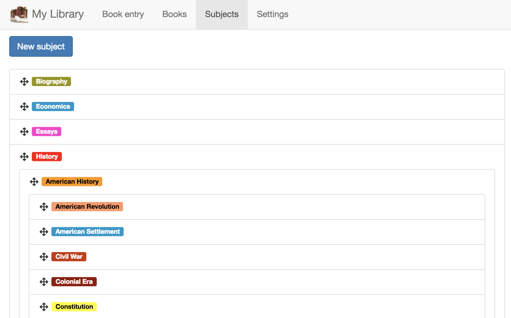

This post will walk you through making a web app work offline. It assumes a working knowledge of service workers and IndexedDB, so if those things are new to you, be sure to check out my prior post on offline development [here](https://css-tricks.com/making-your-web-app-work-offline-part-1/); this post builds heavily on it.

We’ll start by getting our app to load and render offline, thanks to service worker bundle caching. Since a rendered app is of little use if its API requests, ie network traffic, start failing with abandon, we’ll then see about intercepting those fetches, and responding with local IndexedDB data. Lastly, we’ll see how to track offline status in application state so we can adjust our UI, and restrict certain features to online use only.

### A friendly word of caution

While getting a basic service worker configured to pre-cache assets for better performance is relatively straightforward, getting a web app to actually function while offline is not easy. There's no silver bullet; enabling offline functionality requires quite a lot of effort-much more than I assumed when I started this. If you're expecting to see a few apis and utilities you can plug into, and get something working quickly, you may be disappointed. Not only that, but the API of IndexedDB can be extremely un-friendly. While there are helpers on npm like [idb](https://www.npmjs.com/package/idb) and [idb-keyval](https://www.npmjs.com/package/idb-keyval), both by Jake Archibald, to assist with this, this post will use only vanilla API's and features. The **only** reason for this is to help provide a better understanding of the underlying tools, so if you ever decide to attempt this you'll have a better grasp of what's happening, have an easier time choosing suitable helpers, and debug when necessary.

That said, there are limits to this philosophy. Getting a functioning Service Worker to precache, and update your resources as needed would be a project in and of itself. Fortunately there are utilities that can help, namely Google's [Workbox](https://developers.google.com/web/tools/workbox/), which I'll be using below. If you're curious what kind of work would be involved in making such a Service Worker from scratch, check out [this question](https://stackoverflow.com/questions/41616947/managing-service-worker-cache) I asked on Stack Overflow a few years ago, which Jeff Posnick was nice enough to answer.

This post will paint with very broad strokes. The specific code for this will differ a lot from app to app, and as a result I'll try my best to guide samples toward providing a good, high-level understanding. The code here, as with my other posts is from my booklist web app, which I created as a non-contrived way to try out new things (like offline development). If at any point I fail to provide sufficient detail in the code, you can find it all [here](https://github.com/arackaf/booklist/tree/master/react-redux/sw-manual)

## Getting your site rendering while offline

Let's jump right in, and have a look at our Workbox configuration.

```javascript{numberLines: true}
new GenerateSW({
  ignoreUrlParametersMatching: [/./],
  exclude: [/\.(ttf|eot|svg|woff)$/],
  navigateFallback: "react-redux/dist/index.html",
  importScripts: ["react-redux/sw-manual/sw-index-bundle.js"],
});
```

This will cause all of our webpack assets to be precached, excluding some font formats used by older browsers (they’ll still load and function if needed, they just won’t precache in the service worker; in fact, those browsers likely don’t support service workers anyway). The `navigateFallback` property tells workbox to how to handle any navigation requests which are not precached, and `importScripts` tells our generated service worker to import that particular file; that’s where we’ll put our offline syncing code.

## Start Responding To Data Queries

Let’s go offline, and try opening the subjects page. Unsurprisingly, nothing loads since we’re offline, and our network requests fail.


To fix this, let’s set up a Workbox route that looks at what’s being requested, and, if it fails, satisfies the request with data from IndexedDB. Since this app uses GraphQL for its data, this becomes a bit more straightforward: all requests will be under the same path, and we can just inspect the query portion of the url. Of course if you’re not using GraphQL, you’d just inspect the url in some other way to figure out what to load from IndexedDB.

Let’s see some code

```javascript{numberLines: true}
import allSubjects from "../graphQL/subjects/allSubjects.graphql";

workbox.routing.registerRoute(
  /graphql/,
  ({ url, event }) => {
    return fetch(event.request).catch(err => {
      let { query, variables } = parseQueryString(url.search);

      if (query == allSubjects) {
        return readTable("subjects", "name").then(gqlResponse("allSubjects", "Subjects"));
      }
    });
  },
  "GET"
);
```

Let’s break this down. We import the subjects query, and use the `parseQueryString` method, from the [query-string](https://www.npmjs.com/package/query-string) package, to see what’s being requested. If the network request fails, we’ll assume we’re offline, and respond with IndexedDB data, which the `readTable` function retrieves. Lastly, we can’t just return any structure of data we want; we need to precisely match what our online endpoint (GraphQL for this app) would have returned, so our application code will still work.

Let’s take these pieces one by one. First, the `readTable` method

```javascript{numberLines: true}
function readTable(table, idxName) {
  let open = indexedDB.open("books", 1);

  return new Promise(resolve => {
    open.onsuccess = evt => {
      let db = open.result;
      let tran = db.transaction(table);
      let objStore = tran.objectStore(table);
      let idx = objStore.index(idxName);
      let tranCursor = idx.openCursor();

      let result = [];

      tranCursor.onsuccess = evt => {
        let cursor = evt.target.result;
        if (!cursor) return resolve(result);

        let item = cursor.value;
        result.push(item);
        cursor.continue();
      };
    };
  });
}
```

Don’t let the volume of code fool you; all this function is doing is opening a specific index on a table, dumping the results, and returning them. Needless to say, there’s no filtering or paging; I’m trying to keep these first examples as simple as possible.

The `gqlResponse` function is mostly just housekeeping; it puts our results into the format GraphQL would have sent back. Don’t let the double `=>` syntax fool you; that’s just a higher ordered function, or a function that returns a function.

```javascript
const gqlResponse = (op, coll) => data =>
  new Response(JSON.stringify({ data: { [op]: { [coll]: data } } }));
```

And now our subjects will load while offline



## Syncing Data in IndexedDB

What we have so far will respond to offline queries with data that's already in IndexedDB when the user is offline; however, this data will quickly get out of sync as the user makes changes while online.

To keep our data sync'd, we'll set up another route against the same `/graphql` path, but this time we'll listen to POSTs instead of GETs, since that's where our mutations will be happening. The predictable nature of our GraphQL responses make it straightforward to see what was modified, so we can look up the related entry in IndexedDB and sync the changes. Let's walk through it step by step. Here's the code to process the actual GraphQL mutation request.

```javascript{numberLines: true}
workbox.routing.registerRoute(
  /graphql$/,
  ({ url, event }) => {
    let request = event.request.clone();

    return fetch(event.request).then(response => {
      let respClone = response.clone();
      respClone.json().then(response => {
        syncResultsFor({ request, response }, "Book", bookSyncTransform);
        syncResultsFor({ request, response }, "Tag");
      });
      return response;
    });
  },
  "POST"
);
```

We’re running our GraphQL mutations as usual, since we expect them to only run while online. The `response.clone()` is by necessity, since fetch responses can only be consumed once, and calls to `response.json()`, or passing to `event.responseWith` or `cache.put` count as consumption. Beyond that, the code calls `syncResultsFor` to sync the various types that may have been modified by our GraphQL mutation. Let’s turn there, next.

```javascript{numberLines: true}
async function syncResultsFor({ request, response }, name, transform = item => item) {
  let createNameSingle = `create${name}`;
  let data = response.data;
  if (data[createNameSingle] && data[createNameSingle][name]) {
    syncItem(transform(data[createNameSingle][name]), `${name.toLowerCase()}s`);
  }
  let updateNameSingle = `update${name}`;
  if (data[updateNameSingle] && data[updateNameSingle][name]) {
    syncItem(transform(data[updateNameSingle][name]), `${name.toLowerCase()}s`);
  }
  let updateNamePlural = `update${name}s`;
  if (data[updateNamePlural] && data[updateNamePlural][name + "s"]) {
    data[updateNamePlural][name + "s"].forEach(item =>
      syncItem(transform(item), `${name.toLowerCase()}s`)
    );
  }
  let deleteNameSingle = `delete${name}`;
  if (data[deleteNameSingle]) {
    let reqJson = await request.json();
    deleteItem(reqJson.variables._id, name.toLowerCase() + "s");
  }
}
```

This function runs through the various forms our GraphQL results might be in, grabs the updated values, and sync’s with IndexedDB. Naturally your code may differ quite a bit here, depending on how your GraphQL endpoint is designed; this one was auto-generated with my [mongo-graphql-starter](https://github.com/arackaf/mongo-graphql-starter) project.

New or modified objects are sync’d with the `syncItem` function, while deleted objects are removed via the `deleteItem` function, which we’ll look at, in turn.

```javascript{numberLines: true}
function syncItem(item, table, transform = item => item) {
  let open = indexedDB.open("books", 1);

  return new Promise(res => {
    open.onsuccess = evt => {
      let db = open.result;
      let tran = db.transaction(table, "readwrite");
      let objStore = tran.objectStore(table);
      objStore.get(item._id).onsuccess = ({ target: { result: itemToUpdate } }) => {
        if (!itemToUpdate) {
          objStore.add(transform(item)).onsuccess = res;
        } else {
          Object.assign(itemToUpdate, transform(item));
          objStore.put(itemToUpdate).onsuccess = res;
        }
      };
    };
  });
}
```

Here we look up the object by its Mongo `_id`. If it’s there, we update it; if not, we insert it. In either case, an optional transform is applied to the object, to massage the data if needed—for example to duplicate a string field as a lowercase value to index off of, since IndexedDB, at time of writing, does not provide case-insensitive indexes.

The `deleteItem` function is much simpler, and looks like this

```javascript{numberLines: true}
function deleteItem(_id, table) {
  let open = indexedDB.open("books", 1);

  return new Promise(res => {
    open.onsuccess = evt => {
      let db = open.result;
      let tran = db.transaction(table, "readwrite");
      let objStore = tran.objectStore(table);
      objStore.delete(_id).onsuccess = res;
    };
  });
}
```

## Limiting Application Functionality when Offline

A particularly ambitious application might, when offline, collect all attempted POST requests for mutations, and just save them in IndexedDB, to fire when the device is next online. There’s nothing _wrong_ with doing this, just know that it’ll be possible for device B that is online to update the same data while device A is offline, causing A to destroy B’s updates when it comes back online. Obviously optimistic locking could solve this, but the complexity is quickly rising, for a feature that might not be necessary.

Instead, let’s see how we can detect when the user is offline, and add that fact to our application state in order to remove access to any edit or delete buttons.

This section is one of the simplest, since the online and offline events make this straightforward.

```javascript
window.addEventListener(“offline”, () => store.dispatch({ type: IS_OFFLINE }));
window.addEventListener(“online”, () => store.dispatch({ type: IS_ONLINE }));
```

Since this application happens to use Redux, I’m dispatching actions as the online status changes, which wind up in my Redux state. Application code then checks this state to decide whether to hide UI controls that perform actions that are not supported offline.

Non-Redux apps would integrate differently, of course, which is why I’m not showing much more of this code.

## More Advanced Data Retrieval with IndexedDB

The data retrieval so far has been overly simplified: we’ve just been dumping the entire contents of an IndexedDB table, without any filtering, sorting, or paging. Let’s take a look at some code that does all three.

Let me stress, this code is built for speed, _not_ comfort. I wrote this with a mind toward avoiding any unnecessary table scans. It’s entirely likely this will be gross over-engineering for most use cases. I wrote this code as a learning exercise, for a meaningless side project, for fun. Be sure to profile before writing anything like this; as I said, there are many IndexedDB libraries which provide friendly APIs for searching, paging, and filtering data. It’s likely they do so by dumping entire tables in to memory, but as I said, this often won’t matter. **Profile before making any decisions.**

But for fun, let’s dive in and see how this looks with vanilla code. We’ll be searching our books table, with the following assumptions: there are three fields on which the user can sort, in either direction; there’s one field on which the user can filter; and paging is built into the ui, so there will always be a page and page size property.

Normally DBMSs provide these things out of the box, so to implement something like this you’d piece together a dynamic query (while avoiding injection attacks); however, with IndexedDB the api is much more limited. Here, we can only open a cursor either to an object store (table) or an index. Index cursors give us the ability to read forward, or backward, and also the ability to skip a number of records. These features allow us to implement sorting in ascending vs descending order, and pagination, respectively. To do filtering, though, we’ll need to manually inspect each result.

Here’s how we’ll implement this. The sort fields in the GraphQL request will indicate which index to open, and in which direction to read. If there’s no filtering, then things are simple: we’ll skip the appropriate number of rows immediately, and then just read enough items to fill our page. If there is filtering, we need to do considerably more work, since IDB indexes only allow you to seek to a specific value. So when filtering, we’ll need to process each record in the index, manually skip the appropriate number of hits, and then gather up the next number of hits, to fill our page.

Let’s implement this by adding some new, optional arguments to the `readTable` function from before, along with a new function that grabs the books’ arguments before calling `readTable` with them

<!-- prettier: { printWidth: 100 } -->

```javascript{numberLines: true}
function readBooks(variableString) {
  let variables = JSON.parse(variableString);
  let { page = 1, pageSize = 50, title_contains, sort } = variables;

  let predicate = null;
  let limit = pageSize;
  let skipAmount = (page - 1) * pageSize;
  let skip, cursorSkip;

  if (title_contains) {
    let searchRegex = new RegExp(escapeRegex(title_contains), "i");
    predicate = book => searchRegex.test(book.title);
    cursorSkip = 0;
    skip = skipAmount;
  } else {
    cursorSkip = skipAmount;
    skip = 0;
  }

  let sortField = sort ? Object.keys(sort)[0] : null;
  // No sort field will default to sorting by date added, which is the same as sorting by _id, given how
  // Mongo object ID's work.
  let idx = !sort || sortField == "_id" ? "dateAdded" : sortField == "pages" ? "pages" : "title_ci";
  let idxDir = sortField && sort[sortField] == -1 ? "prev" : void 0;

  return readTable("books", idx, {
    predicate,
    skip,
    cursorSkip,
    limit,
    idxDir,
  }).then(gqlResponse("allBooks", "Books", { Meta: { count: 12 } }));
}

function readTable(table, idxName = null, { predicate, idxDir, cursorSkip, skip, limit } = {}) {
  let open = indexedDB.open("books", 1);

  if (!predicate) {
    predicate = () => true;
  }

  return new Promise(resolve => {
    open.onsuccess = evt => {
      let db = open.result;
      let tran = db.transaction(table);
      let objStore = tran.objectStore(table);

      let tranCursor = idxName
        ? objStore.index(idxName).openCursor(null, idxDir)
        : objStore.openCursor(idxDir);
      let result = [];
      let skipped = 0;
      let hasSkipped = false;

      tranCursor.onsuccess = evt => {
        let cursor = evt.target.result;
        if (cursorSkip && !hasSkipped) {
          hasSkipped = true;
          return cursor.advance(cursorSkip);
        }
        if (!cursor) return resolve(result);

        let item = cursor.value;
        if (predicate(item)) {
          if (skip && skipped < skip) {
            skipped++;
          } else {
            result.push(item);
          }
          if (limit && result.length == limit) {
            return resolve(result);
          }
        }
        cursor.continue();
      };
    };
  });
}
```

The `cursorSkip` argument taps right into the cursor, and jumps over that number of records. This is possible when there’s no filtering; when there is, the `skip` argument indicates how many records to skip, manually, based on the filtering predicate.

I’ll stress once more that abstractions can make that code considerably simpler. The only redeeming thing about what’s here is perf; the entire table is never processed, except in the unlikely event that the user pages all the way to the last page (or the table is so small that it fits in one page). If your volume of data is small enough that this doesn’t matter, which it likely will be, then look to an IndexedDB helper to simplify things. **Always profile and measure before deciding.**

Happy coding!

### Further Readubg

If you’d like to dig in more deeply to IndexedDB, Service Workers, and or PWAs in general, you won’t do better than [Progressive Web Apps](https://www.amazon.com/Building-Progressive-Web-Apps-Bringing/dp/1491961651/ref=sr_1_2?ie=UTF8&qid=1545942601&sr=8-2&keywords=progressive+web+app) by Tal Ater.
