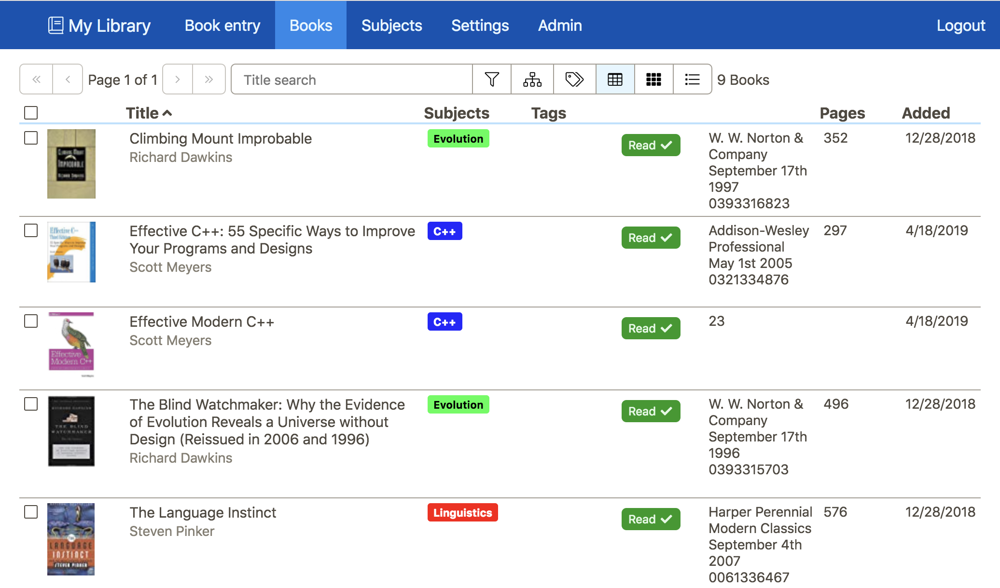
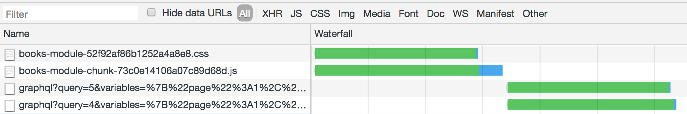
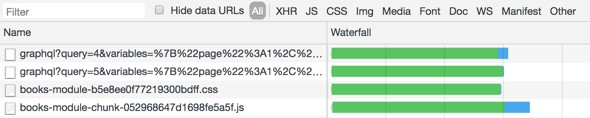
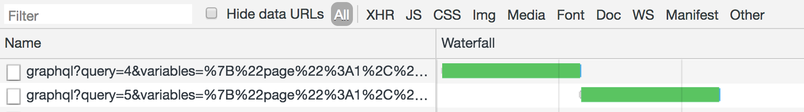
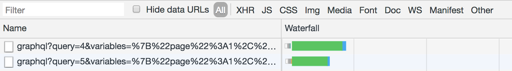

React Suspense can be difficult to understand, at first. This blog post is my attempt at explaining what problems it solves, with what primitives. I'll take you through the primitives, step by step, showing what they do, why, and how they're employed.

What this post is _not_ is a quick guide to improving your application's data loading with Suspense. If that's all you want, just read the docs for the modern Suspense-enabled Relay, and go to work.

## The Plan

As usual with these posts, the code will all come from my Booklist project. This is a side project of mine that basically exists for me to learn modern JS tools with. You don't really know a software engineering library until you build something with it, and this is that something, for me, when I have something that needs learning. Needless to say, since this entire project is the product of my own efforts, in scarce free time, don't expect high quality for this app (especially the design). But it's good enough to explore ideas, which is our goal, here.

Our data loading will be done with my `micro-graphql-react` library, which provides some simple data GraphQL React bindings. I've updated this library to have the pieces necessary to use Suspense, but of course any Suspense-ready library (and expect your favorite library to be updated soon, if it's not already) could be used instead.

## Our Use Case

Suspense is all about coordinating multiple async operations in such a way that your UI stays consistent. Let's explore what that means with an example. The booklist app unsurprisingly has a screen to display your current books in a table.



The books results are paged, but we also show the total number in that result set. Currently it's a single request that fetches the books, and the total, but let's pretend those two pieces of data are fetched with different queries—and for this blog post, I did split them out. As the current search changes, we fire off a new request to get our books, and a new request to get the total count for that result set. As each request is running, there's some sort of loading indicator in place. The books table has a subtle spinner overlaid, and the book count shows a spinner next to it, when the next result is fetching. Since they're distinct async operations, we have no control over which will finish first, or even how closely together these operations will finish. That means the new books list may come in first, while the count for the previous search results continues to show, with a spinner next to it—or vice versa.

Coordinating these separate async operations in order to prevent this **inconsistent UI** is the entire point of what we're doing here.

## You may not need Suspense

Before I move on, I'd just like to note that, if your particular web app doesn't have multiple async operations running at the same time, which need to be coordinated, then you absolutely may not need Suspense. Please don't slog through this whole post, then take to social media to complain about how hard React now is. The same React you've been using will still work, and if you ever do need something like this, it's there.

## But first, that waterfall

Before we look at coordinating those requests, let's solve an unrelated imperfection: when we browse to this module, our initial query does not fire until after the code for the books list component has loaded. This makes sense if we think about it. These queries are run from hooks called in our components, so the components' code needs to load, before those queries can run. We can see this in the network tab: our queries don't run until after our code is done loading.



The fix for this has absolutely nothing to do with Suspense, but it'll be extremely relevant later. We need to preload our query. Hopefully our data loading library has some sort of preload method that can kick off a data request ahead of time. For my GraphQL client, it's a preload method, so let's call that in our routing code. For this app and use case, the preloading happens to look like this

```typescript
export default function preload() {
  let variables = bookSearchVariablesFromCurrentUrl();
  graphqlClient.preload(GetBooksQuery, variables);
  graphqlClient.preload(GetBooksCountQuery, variables);
}
```

and after importing, and calling that function in our routing code, after thee books module becomes active, we see the waterfall vanish



I'll stress, this has nothing to do with Suspense, or even React. No matter what JS framework you're using, you should preload data as soon as you know you'll need it, even if your UI code isn't loaded yet.

## And now, Suspense

Ok let's get those two data requests above in sync now. First, let's wrap our module with a `Suspense` component, like this. Make sure your `<Suspense>` boundary is *above* any components which are reading data. That won't make a difference yet, but it'll affect `useTransition` in a bit.

```tsx
export default () => {
  return (
    <Suspense fallback={<h1>Loading, yo</h1>}>
      <MainBookModule />
    </Suspense>
  );
};
```

Now, as things are loading, we display the specified placeholder, which will not leave until everything is ready. The way we specify that we're waiting on something is by throwing a promise. This applies to components wrapped with `React.lazy`, and also our data. `React.lazy` of course handles the promise throwing internally, but data loading is our responsibility. For `micro-graphql-react`, we'll use the `useSuspenseQuery` hook.

```typescript
const { data, loading, loaded, currentQuery } = useSuspenseQuery<
  QueryOf<Queries["allBooks"]>
>(buildQuery(GetBooksQuery, variables, { onMutation: onBooksMutation }));
```

See the docs for more info, but `useSuspenseQuery` has an identical api to `useQuery`, except it throws a promise when used if, (and only if), the requested data are not ready. And now, lo and behold, our app does not activate until all of our data are ready. Our silly "Loading, yo" message will show when the component first mounts, if either piece of data are ready.

Hooray!

But there's a problem. Two in fact. When we change our search parameters, our entire UI abruptly vanishes, to show that same "Loading, yo" from before.

We'd probably prefer to just show the current data, and then update it all when ready—perhaps with a subtle, inline spinner to show that new data are being loaded. The other problem is worse: we've introduced a new waterfall. On each update, each of our queries run serially.



This is because `useSuspenseQuery` is throwing a promise when encountered. That causes React to suspend rendering (get it - that's why it's called Suspense), until that data are ready. The fix for the waterfall is the same as the fix for the original waterfall: preload. When our URL changes, just preload the new data we'll need, using the exact same preload method from before. If you're using any kind of decent routing component, you can likely do this preload in one place, as your `<Route />` receives new match parameters. Since my app is not using a decent routing library, I'll just have to duplicate that function call, but that shortcoming is entirely due to my own architecture, and not React or Suspense

```typescript
useEffect(() => {
  return history.listen(() => {
    preload(); //preload before updating!
    const { searchState } = getCurrentHistoryState();
    dispatch(hashChanged(searchState));
  });
}, []);
```

And now our waterfall is gone



## useTransition

Now let's make the UX a little nicer. Wouldn't it be nice if, instead of setting our new state, and kicking off a render that threw promises, triggering our `Suspense` boundary, which removed our existing UI, we could, instead, tell React start the new render, but "off to the side, in memory." What if we could tell React: fork my entire app to an in-memory copy, apply the state there, and then apply the new, updated UI to the screen when it's all ready, or after a specified amount of time has expired (whichever comes first). That's what useTransition does, and I'll explain it some more, don't worry.

Here's how we use it

```typescript
let [startTransition, isPending] = useTransition({
  timeoutMs: 3000
});

// ...

useEffect(() => {
  return history.listen(() => {
    // `unstable_runWithPriority(unstable_UserBlockingPriority` is temporary,
    // since we're calling startTransition outside of a render method
    // and shouldn't be required when Suspense is actually released.
    unstable_runWithPriority(unstable_UserBlockingPriority, () => {
      startTransition(() => {
        preload(); //preload before updating!
        const { searchState } = getCurrentHistoryState();
        dispatch(hashChanged(searchState));
      });
    });
  });
}, []);
```

this tells React to start rendering this state change in a detached, in-memory copy of my app. If everything finishes, and stops throwing promises before the 3 second timeout, then cool, we'll update the UI then, with our new, consistent results. If it's not done within three seconds, then we'll apply it anyway, in it's suspended state.

The `isPending` does what it says, and we can use it to display some sort of local loading indicator. The difference is, that loading indicator will represent the loading state of *all* pending async operations. Again, that's what Suspense gives us: it allows us to coordinate multiple, separate async operations. Previously we would have to co-locate these data requests somehow, and tie them together with `Promise.all`, or similar. 

Tweak that timeout amount as desired, and remember, you can use anything you want for the fallback display. The "Loading, yo" was silly and snarky; in practice you'll likely make it a shell of your actual UI, with a special message indicating how sorry you are that this search is taking so long.

## Where to, from here

Remember, you can place `<Suspense>` boundaries wherever you want. If a promise is thrown during rendering, React will render the fallback of the _first_ Suspense boundary it can find, by walking _up_ the tree from where the exception was thrown. You can also use `useTransition` wherever you want, for any state change that involves async data loading (including lazy-loaded components created with `React.lazy`)

With that in mind, let's briefly note that these same primitives will likely need to be integrated into whatever routing solution you're using. New route parameters will likely need to be set with `useTransition`, with some sort of soft spinner that can display over the old route, while the new one loads. Which of course means you'll need a `<Suspense />` boundary at the very top of your app, to handle route transitions that take longer than the specified timeout.

## Wrapping up

React Suspense provides some incredibly exciting primitives to help coordinate async actions, and improve the smoothness, and consistency of the user interfaces we build. It's never been a better time to be a React developer.

Happy Coding!
